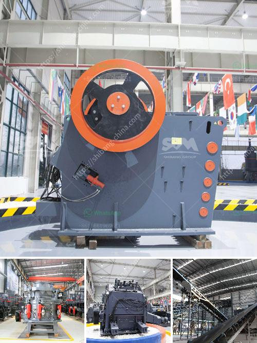

<h3>gold recovery equipment for small mining companies</h3>
In recent years, the price of gold has reached record highs, attracting numerous small mining companies to enter the market. These companies often face challenges in extracting gold efficiently and cost-effectively. However, with the right gold recovery equipment, small mining companies can maximize their gold extraction potential and achieve profitable operations.

One essential piece of equipment for small mining companies is a gold concentrator. A gold concentrator is a device that separates fine gold particles from the unwanted material, such as rocks and sand, using gravity and water flow. It works on the principle of centrifugal force, which allows heavy gold particles to settle to the bottom while lighter materials are washed away.

There are various types of gold concentrators available in the market, each with its own advantages. One popular option is the spiral wheel concentrator, which is compact, easy to use, and requires minimal maintenance. The spiral wheel concentrator uses a spinning wheel to create a high-speed rotation motion, enabling the collection and retention of fine gold particles.

Another widely used gold recovery equipment is the sluice box. A sluice box is a long narrow box with riffles or obstructions on the bottom surface. It works by channeling water with sediments, including gold particles, through the box. The obstructions on the bottom surface of the sluice box trap heavier materials, allowing the gold to settle and accumulate.

To maximize gold recovery, small mining companies should also consider using a shaker table. A shaker table is a specialized vibrating table that uses a shaking motion to separate gold from the unwanted material. It is particularly effective for separating fine gold particles, which may be missed by other recovery methods. Shaker tables are designed to accommodate different feed rates and often feature adjustable slopes to optimize the separation process.

In addition to these primary gold recovery equipment, small mining companies should invest in a reliable gold detector. A gold detector is an electronic device that senses the presence of gold buried beneath the surface. It can help miners locate potential gold-rich areas and save time and effort by focusing their operations in the right locations.

When choosing gold recovery equipment, small mining companies should consider their specific needs, operational scale, and budget constraints. It is important to select equipment that is durable, efficient, and suited for the geological conditions of the mining area. Additionally, small mining companies should consider the availability of spare parts and after-sales service for the chosen equipment to minimize downtime and ensure continuous operations.

Overall, gold recovery equipment plays a crucial role in the success of small mining companies. By investing in the right equipment, these companies can increase their gold extraction efficiency, reduce operational costs, and ultimately achieve profitability. As the demand for gold continues to rise, small mining companies that have the right equipment in place will be well-positioned to capitalize on this lucrative market.
<h3>Contact us</h3><ul><li><strong>Whatsapp:&nbsp;<a href="https://wa.me/8613661969651">+8613661969651</a></strong></li><li><a href="https://swt.shibang-china.com/?git&amp;zhl&amp;gold recovery equipment for small mining companies"><strong>Online Service(chat now)</strong></a></li></ul><h3>Related</h3><ul><li><a href='shaft hammer crusher hds.md'>shaft hammer crusher hds</a></li><li><a href='ball mill manufacturers in india.md'>ball mill manufacturers in india</a></li><li><a href='raymond mill manufacturers in india.md'>raymond mill manufacturers in india</a></li><li><a href='ball mills vietnam.md'>ball mills vietnam</a></li><li><a href='crushing and grinding equipment cost in ethiopia.md'>crushing and grinding equipment cost in ethiopia</a></li></ul>