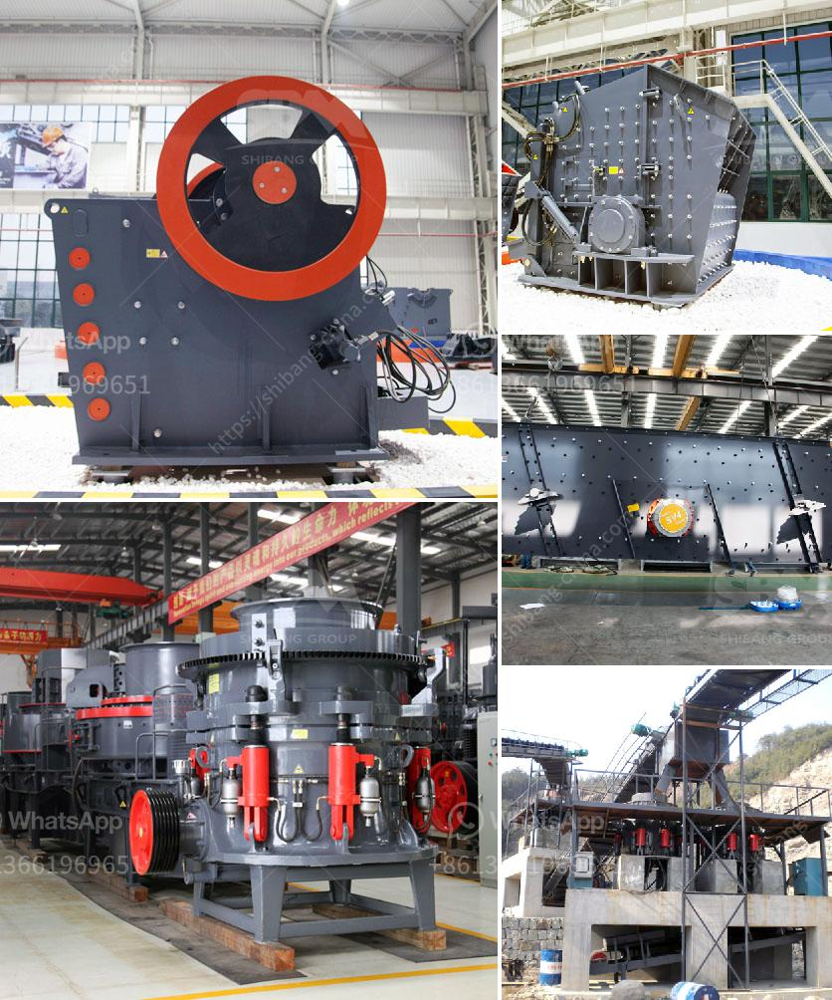

<h3>gold separating machine for sale in south africa</h3>
Gold mining is perhaps the oldest mining activity around the world. Gold mining equipment typically includes a gold sluice box, shaking table, and gold separating machine. With the wealth of minerals in South Africa, it is no wonder that mining is one of the largest contributors to the country's GDP. 

As an abundant mineral resource, gold ore is present in South Africa's varied geological formations. With mining being an integral part of the country's history and economy, the gold industry is a significant sector in the nation's overall mining portfolio. 

To efficiently extract gold from the ore, several methods are employed, including cyanide leaching, gravity separation, and flotation. However, one of the most effective and widely used techniques is gravity separation. 

Gravity separation is the process of separating material particles based on their specific gravity. In the case of gold mining, the gold ore is crushed and ground to the desired size, and then passed on to a gold separating machine, such as a gold sluice box or shaking table. 

These gold separating machines are compact, lightweight, and portable, making them perfect for use in remote areas where access to electricity is limited or nonexistent. 

The gold sluice box is a simple piece of gold mining equipment that uses the forces of gravity and water to separate gold particles from dirt and other materials. The sluice box consists of a long, narrow trough with riffles or grooves cut into the bottom. The gold-containing ore is fed into the sluice box, and water is then directed through it, causing the lighter materials to be carried away while the heavier gold particles settle into the riffles. 

Shaking tables, on the other hand, are designed to separate gold particles based on their density and size. The table is equipped with a vibrating deck that shakes back and forth, causing the gold particles to move along the surface. The heavier gold particles quickly travel to the bottom of the table, while the lighter materials are washed off the edges. 

Gold separating machines have become essential equipment in the gold mining industry, and there are several manufacturers and suppliers of gold separating machines in South Africa. 

As is typical with any type of mining equipment, prices of gold separating machines can vary depending on the manufacturer and model. However, the cost of a gold separating machine should not be a deterrent in choosing the right product for your mining operation. 

When purchasing a gold separating machine in South Africa, you should consider the reputation of the manufacturer, the durability and performance of the machine, the after-sales service provided, and the availability of spare parts. 

In conclusion, gold separating machines are essential equipment in the gold mining industry, enabling the extraction of precious minerals from the gold ore. With South Africa being a prominent player in the gold mining industry, it is crucial to have reliable and efficient gold separating machines to ensure optimal mining operations.
<h3>Contact us</h3><ul><li><strong>Whatsapp:&nbsp;<a href="https://wa.me/8613661969651">+8613661969651</a></strong></li><li><a href="https://swt.shibang-china.com/?git&amp;zhl&amp;gold separating machine for sale in south africa"><strong>Online Service(chat now)</strong></a></li></ul><h3>Related</h3><ul><li><a href='grinding machine for white clay in india.md'>grinding machine for white clay in india</a></li><li><a href='grinding mills supplier in gujranwala pakistan.md'>grinding mills supplier in gujranwala pakistan</a></li><li><a href='process of limestone crusher.md'>process of limestone crusher</a></li><li><a href='ball mills for 6 x 6 mining.md'>ball mills for 6 x 6 mining</a></li><li><a href='copper manufacturing process.md'>copper manufacturing process</a></li></ul>