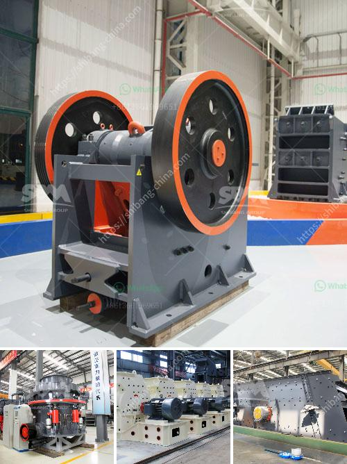

<h3>gold wash plant at south africa gold mine</h3>
South Africa is known for its rich reserves of gold, but it is slowly becoming depleted as companies continue to extract this precious metal. What will happen once all the gold is gone? Is there a solution to this dilemma? Fortunately, advancements in technology have paved the way for various innovations in the mining industry, leading to the development of gold wash plants.

A gold wash plant is a piece of equipment that is used to separate gold-bearing soil, sand, or gravel from the rest of the material. In most cases, the plant is a trommel screen that works like a giant sieve, constantly shaking and turning as smaller gold particles and other minerals filter through the holes. The larger rocks and debris are discarded, leaving behind the valuable gold particles.

One such gold wash plant in South Africa, the Sibanye Gold Mine, has been successfully used to extract gold in the region. This gold wash plant uses three-stage trommel screens to classify the material and separate the gold particles. The trommel screens are designed with different mesh sizes to ensure the efficient separation of gold from the rest of the material.

The process begins with the gold-bearing material being fed into the plant's hopper by a front-end loader. This material is then transported to the primary trommel screen, where it is broken down into smaller particles. The classified material is then sent into two secondary trommel screens, each with a different mesh size. The smallest particles are sent to the concentrator, where the gold is further concentrated.

The efficiency of the gold wash plant is crucial in ensuring maximum gold recovery. Each trommel screen is equipped with spray bars that continuously spray water onto the material, helping to separate the gold particles from the rest of the material. This water washes away the unwanted material, allowing the gold to settle and be collected.

The gold wash plant at the Sibanye Gold Mine has proven to be highly effective in extracting gold from the region. With a processing capacity of over 200 tons per hour, it is capable of processing large volumes of material to maximize gold recovery. This plant has been operational for several years, consistently producing significant gold output.

The use of gold wash plants in South Africa's gold mines is a step in the right direction towards sustainable mining practices. By separating gold particles from the rest of the material, these plants minimize the environmental impact of mining operations. Additionally, they ensure the maximum extraction of gold from the limited reserves, extending the lifespan of gold mines in the area.

In conclusion, gold wash plants have revolutionized the mining industry in South Africa by maximizing gold recovery and minimizing environmental impact. These plants use trommel screens to classify and separate gold-bearing material, ensuring efficient gold extraction. As gold reserves continue to deplete, it is imperative to adopt sustainable mining practices like the use of gold wash plants to ensure a prosperous future for the gold mining industry in South Africa.
<h3>Contact us</h3><ul><li><strong>Whatsapp:&nbsp;<a href="https://wa.me/8613661969651">+8613661969651</a></strong></li><li><a href="https://swt.shibang-china.com/?git&amp;zhl&amp;gold wash plant at south africa gold mine"><strong>Online Service(chat now)</strong></a></li></ul><h3>Related</h3><ul><li><a href='graphite crusher products.md'>graphite crusher products</a></li><li><a href='100 tpd kiln project cost.md'>100 tpd kiln project cost</a></li><li><a href='ball mill micron.md'>ball mill micron</a></li><li><a href='bentonite grinding project.md'>bentonite grinding project</a></li><li><a href='estimated cost for cement grinding mill.md'>estimated cost for cement grinding mill</a></li></ul>