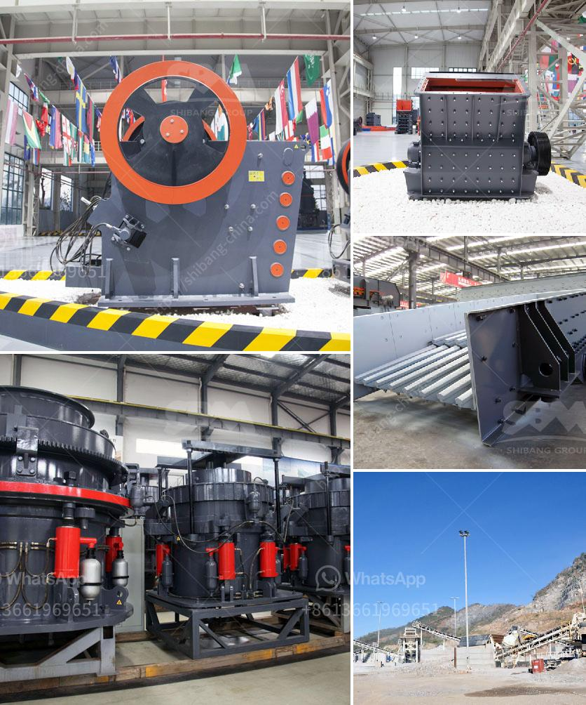

<h3>granite business plan ppt</h3>
The granite business has been thriving for many years, as it is a lucrative industry that provides various opportunities for growth and profitability. However, starting a granite business requires careful planning and strategic thinking to ensure success in the competitive market. One crucial tool for presenting your granite business plan is a PowerPoint presentation (PPT). A well-crafted granite business plan PPT can effectively communicate your vision, market analysis, financial projections, and strategies to potential investors, lenders, and partners.

To begin your granite business plan PPT, it is essential to have a clear understanding of your business concept. Define your niche, whether it is selling granite slabs, providing fabrication services, or both. Identify your target market and create a comprehensive analysis of the current demand for granite in your region. This analysis should include information on the local construction industry, interior design trends, and the purchasing power of your potential customers.

The next step in your granite business plan PPT is to outline your marketing strategies. Explain how you plan to position your business in the market, highlight your unique selling points, and showcase your competitive advantage. Consider diversifying your marketing channels, such as reaching out to contractors, architects, designers, and homeowners through online platforms, trade shows, and direct marketing efforts.

In the financial section of your granite business plan PPT, provide a detailed breakdown of your start-up costs, including expenses for equipment, inventory, permits, and licensing. Determine the amount of funding you will need to get your business off the ground and whether you will rely on personal savings, loans, or investors. Develop a realistic sales forecast by considering factors such as the average price of granite slabs, expected number of customers, and potential revenue from fabrication services.

Investors and lenders will be particularly interested in your profit and loss projection, as this demonstrates your ability to generate revenue and manage expenses effectively. Highlight expected costs, such as rent, utilities, salaries, and marketing, and provide projected revenues based on your marketing strategies and market analysis. Include a breakeven analysis to showcase when your business is expected to start making a profit.

Another crucial element to include in your granite business plan PPT is an operational plan. Outline your production process, including how you source granite, fabricate it, and deliver it to customers. Highlight any certifications or accreditations you have obtained, as these can boost customer trust and credibility. Additionally, explain your quality control measures to ensure that your granite meets industry standards and customer expectations.

Lastly, provide an overview of your management team and their relevant experience and skills. This demonstrates to potential investors that you have the necessary expertise to run a successful granite business. If you have any unique strategies, such as sourcing granite from environmentally friendly suppliers, emphasize this in your presentation, as it can set you apart from competitors.

In conclusion, a well-prepared granite business plan PPT can be an invaluable tool in obtaining financing and attracting business partners. By meticulously outlining your market analysis, marketing strategies, financial projections, operational plan, and management team, you can showcase your business's potential and increase your chances of success in the granite industry. Remember to practice your presentation thoroughly to ensure that you effectively convey your passion, knowledge, and commitment to your granite business.
<h3>Contact us</h3><ul><li><strong>Whatsapp:&nbsp;<a href="https://wa.me/8613661969651">+8613661969651</a></strong></li><li><a href="https://swt.shibang-china.com/?git&amp;zhl&amp;granite business plan ppt"><strong>Online Service(chat now)</strong></a></li></ul><h3>Related</h3><ul><li><a href='how to start a coal mine.md'>how to start a coal mine</a></li><li><a href='stacker conveyors suppliers.md'>stacker conveyors suppliers</a></li><li><a href='basic process in producing clay products.md'>basic process in producing clay products</a></li><li><a href='mini ball mill crusher.md'>mini ball mill crusher</a></li><li><a href='clay making process nigeria.md'>clay making process nigeria</a></li></ul>