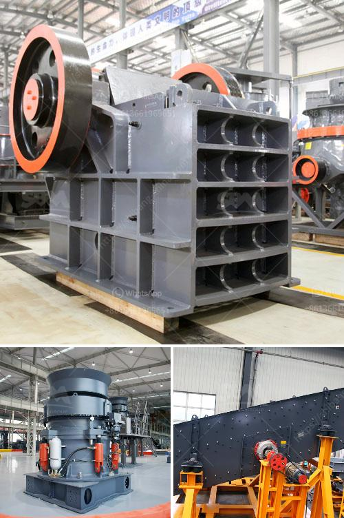

<h3>granite crusher for sale</h3>
Granite, a type of igneous rock, is one of the most popular construction materials in the world. It is widely used in a variety of industries including construction, agriculture, and landscaping. However, extracting granite from quarries can be a laborious process, especially if the deposits are deep beneath the earth's surface. This is where a granite crusher comes into play.

A granite crusher is a necessary piece of equipment in the mining industry. As the name suggests, it is used to crush granite into small pieces. The granite crushers can deal with materials ranging from 10mm to 700mm and compressive strength is less than 350Mpa. With its excellent performance and good durability, the granite crusher is widely used in crushing various types of ores and bulk materials.

One significant advantage of using a granite crusher is its ability to crush large granite rocks into smaller, more manageable sizes. Granite is famously hard and tough which makes it an ideal material for construction projects. However, its hardness can also make it difficult to crush, resulting in increased labor and time. The granite crusher simplifies this process by breaking down the granite into more manageable sizes, making it easier to transport and use in various applications.

The granite crusher for sale is available in both stationary and mobile forms. Both of them have their unique advantages. For example, a mobile granite crusher can be loaded onto a truck using a crane and then driven away, eliminating the need for transportation costs. On the other hand, a stationary granite crusher is more suitable for large-scale operations where the crusher is needed at a fixed location.

When choosing a granite crusher for sale, it is essential to consider factors such as the crushing capacity, the specific application, and the desired end product size. It is also worth checking the overall condition of the equipment, such as the engine, the hydraulic system, and the wear parts. Investing in a high-quality granite crusher will ensure long-term efficiency and productivity.

In conclusion, a granite crusher is an indispensable piece of equipment for crushing granite rocks. It simplifies the process of extracting granite and makes the material suitable for various applications. Whether it's for construction, agriculture, or landscaping, a granite crusher for sale is a worthwhile investment that will enhance productivity and profitability.
<h3>Contact us</h3><ul><li><strong>Whatsapp:&nbsp;<a href="https://wa.me/8613661969651">+8613661969651</a></strong></li><li><a href="https://swt.shibang-china.com/?git&amp;zhl&amp;granite crusher for sale"><strong>Online Service(chat now)</strong></a></li></ul><h3>Related</h3><ul><li><a href='aggregate production equipment.md'>aggregate production equipment</a></li><li><a href='stone crusher machine sale in zambia.md'>stone crusher machine sale in zambia</a></li><li><a href='companies manufacturing quarry plant in uk.md'>companies manufacturing quarry plant in uk</a></li><li><a href='stone crusher in spain.md'>stone crusher in spain</a></li><li><a href='cement clinker crushing plant.md'>cement clinker crushing plant</a></li></ul>