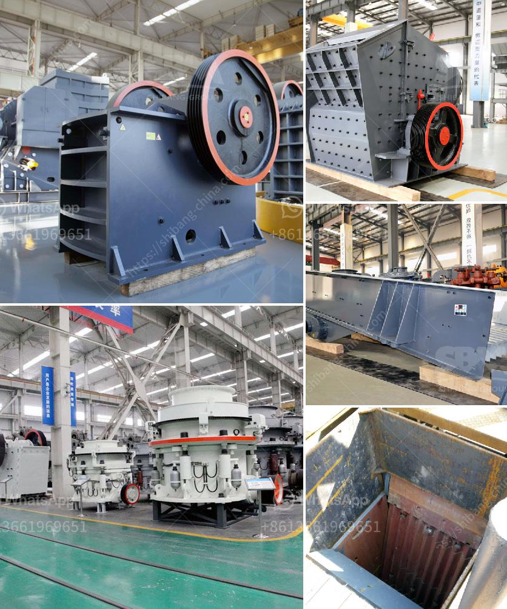

<h3>granite crushing companies</h3>
Granite is a hard rock material that is widely used in construction and various other industries. To obtain granite in a usable form, it needs to be crushed and processed. This is where granite crushing companies come into play.

Granite crushing companies are specialized firms that take granite rocks and break them down into smaller, more manageable pieces. These smaller pieces are then used for various applications such as in building materials, landscaping, and pavement. The crushing process typically involves several stages, including primary crushing, secondary crushing, and even tertiary crushing if necessary.

There are numerous granite crushing companies all around the world, catering to the varying demands of the market. These companies usually have state-of-the-art machinery and equipment, which helps them efficiently crush granite rocks into desired sizes. They also employ skilled workers who are trained in operating the machinery safely and effectively.

One key advantage of hiring a granite crushing company is that they have expertise in the field. They know the best techniques and methods for crushing granite, ensuring that the end product meets the required specifications. These companies also have access to various types of crushers, screens, and other essential equipment, enabling them to handle different types of granite rocks.

Moreover, granite crushing companies often have a large inventory of crushed granite, which can be readily supplied to customers. This eliminates the need for customers to invest in costly crushing equipment themselves. It also ensures a steady supply of crushed granite for construction projects, ensuring uninterrupted progress.

In conclusion, granite crushing companies play a fundamental role in the construction industry and various other sectors. They possess the necessary expertise, machinery, and inventory to efficiently crush and process granite rocks. By utilizing their services, customers can save time, money, and effort while ensuring high-quality crushed granite for their projects.
<h3>Contact us</h3><ul><li><strong>Whatsapp:&nbsp;<a href="https://wa.me/8613661969651">+8613661969651</a></strong></li><li><a href="https://swt.shibang-china.com/?git&amp;zhl&amp;granite crushing companies"><strong>Online Service(chat now)</strong></a></li></ul><h3>Related</h3><ul><li><a href='quotes hammer mill.md'>quotes hammer mill</a></li><li><a href='material using for making talcum powder.md'>material using for making talcum powder</a></li><li><a href='stone crusher fairs.md'>stone crusher fairs</a></li><li><a href='flow chart for gold extraction from ores.md'>flow chart for gold extraction from ores</a></li><li><a href='gold ore 300 550tph cs cone crusher for sale.md'>gold ore 300 550tph cs cone crusher for sale</a></li></ul>