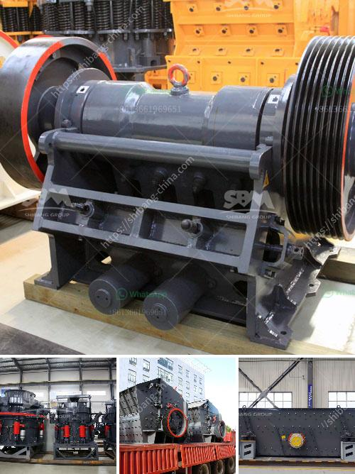

<h3>granite edge cutting machine in sweden</h3>
Granite, an elegant and durable natural stone, continues to be a popular choice for various applications such as kitchen countertops, flooring, and building facades. In Sweden, where the stone's abundance and beauty are celebrated, the evolution of granite cutting technology has been pivotal in meeting demand while ensuring precision and efficiency. Among the key players in this field are granite edge cutting machines, which have revolutionized the way granite is processed and shaped.

Renowned for its aesthetic allure, granite's appeal lies in its uniqueness, as no two slabs are exactly alike in terms of color, pattern, or texture. This distinctiveness often poses a challenge when it comes to precision cutting, as traditional methods were prone to human error. However, edge cutting machines have changed the game by combining automation, precision, and efficiency. With computer-guided processes, these machines can flawlessly execute intricate cutting patterns or tailor granite pieces to specific dimensions, thereby ensuring high accuracy and reducing material waste.

Sweden has been at the forefront of advancing granite edge cutting technology, with cutting-edge machines designed by local manufacturers that cater to the specific needs of the industry. These machines employ diamond cutting tools, which are renowned for their durability and precision. The machines are equipped with advanced computerized systems that can accurately measure dimensions, enable precise cuts, and minimize errors. Additionally, some edge cutting machines have integrated water jets to reduce heat generated during the cutting process, preserving the natural beauty of the granite and extending the life of the tools.

In the age of sustainable manufacturing, efficiency and environmental impact have become crucial considerations. Granite edge cutting machines in Sweden are designed with energy-efficient features, ensuring optimal power consumption while maintaining cutting precision. Moreover, automated processes minimize manual labor, reducing the risk of injuries and improving worker safety. By optimizing material usage and minimizing waste, these machines contribute to sustainable practices. Additionally, water recycling technology used in some machines helps conserve water resources, thus reducing the environmental footprint of the granite cutting process.

The advent of granite edge cutting machines in Sweden has dramatically enhanced the precision, efficiency, and safety of granite cutting processes. These state-of-the-art machines have revolutionized the industry by significantly reducing human error, increasing productivity, and optimizing resource usage. From kitchens to commercial buildings, the application of granite has soared, thanks to these innovative machines.
<h3>Contact us</h3><ul><li><strong>Whatsapp:&nbsp;<a href="https://wa.me/8613661969651">+8613661969651</a></strong></li><li><a href="https://swt.shibang-china.com/?git&amp;zhl&amp;granite edge cutting machine in sweden"><strong>Online Service(chat now)</strong></a></li></ul><h3>Related</h3><ul><li><a href='calcium ball mill.md'>calcium ball mill</a></li><li><a href='manganese wash plant zambia.md'>manganese wash plant zambia</a></li><li><a href='crusher price in malaysia stones.md'>crusher price in malaysia stones</a></li><li><a href='used vibro screener for sale.md'>used vibro screener for sale</a></li><li><a href='purchase of stone crusher.md'>purchase of stone crusher</a></li></ul>