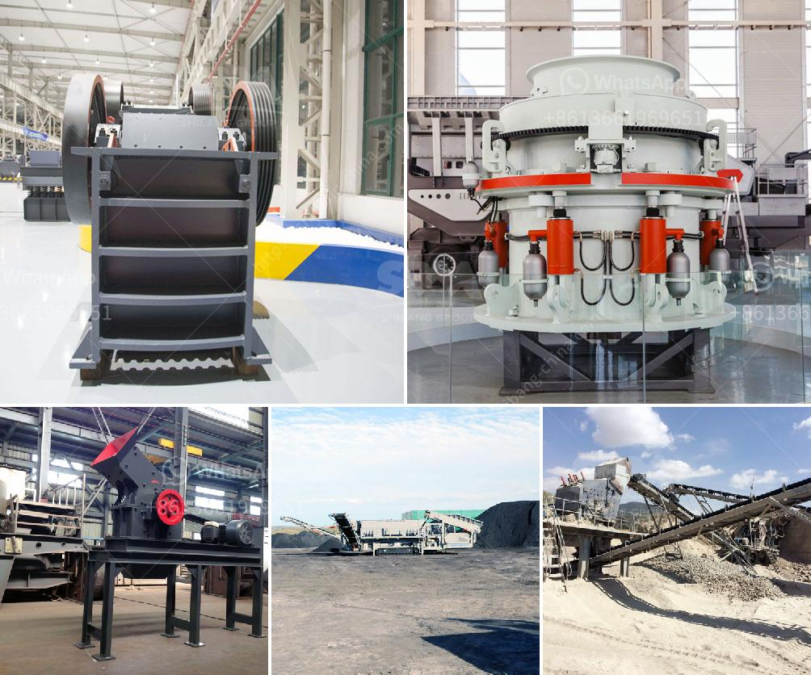

<h3>granite quarry plants for sale</h3>
Granite is a highly sought-after material for both residential and commercial applications. Its durability, elegance, and natural beauty make it a popular choice for countertops, flooring, and various other construction and landscaping projects. To meet the growing demand for granite, there are numerous granite quarry plants for sale that offer investors an opportunity to venture into this lucrative industry.

Granite quarry plants are the primary source where granite is extracted from the ground. These plants refine the granite into different sizes, shapes, and finishes, catering to diverse customer requirements. With advancements in technology and quarrying techniques, these plants have become more efficient and productive, resulting in higher quality granite products.

Investing in a granite quarry plant can be a wise decision for those looking to enter the construction or landscaping industry. Here are some key reasons why:

1. Profitability: Granite is a high-value material with a strong market demand. As a result, granite quarry plants have the potential for significant profits. The growing demand for granite in various industries ensures a steady stream of customers and a reliable return on investment.

2. Versatility: Granite is incredibly versatile, making it suitable for a wide range of applications. From kitchen countertops to outdoor paving, granite adds a touch of elegance and sophistication to any space. Investing in a granite quarry plant allows investors to offer a diverse range of granite products, catering to different customer preferences and market needs.

3. Sustainability: Granite is a natural stone that is abundant in nature. Unlike many synthetic materials, granite is eco-friendly and sustainable. Investing in a granite quarry plant promotes the use of a natural resource in a responsible and sustainable way, contributing to environmental preservation and reducing the reliance on synthetic alternatives.

4. Longevity: Granite is known for its durability and resistance to wear and tear. It can withstand heavy use and is highly resistant to scratches, heat, and stains. Investing in granite quarry plants allows investors to offer a product that is long-lasting and low-maintenance, ensuring customer satisfaction and repeat business.

5. Market demand: The demand for granite continues to grow worldwide, driven by factors such as urbanization, infrastructure development, and increasing disposable incomes. Investing in a granite quarry plant puts investors in a favorable position to tap into this growing market, ensuring a steady demand for their products.

In conclusion, granite quarry plants for sale offer an attractive investment opportunity for individuals looking to enter the construction or landscaping industry. With rising market demand, profitability, versatility, sustainability, and long-term durability, investing in a granite quarry plant can be a wise decision. It provides investors with the means to contribute to the construction sector while reaping the financial rewards of a highly sought-after natural resource.
<h3>Contact us</h3><ul><li><strong>Whatsapp:&nbsp;<a href="https://wa.me/8613661969651">+8613661969651</a></strong></li><li><a href="https://swt.shibang-china.com/?git&amp;zhl&amp;granite quarry plants for sale"><strong>Online Service(chat now)</strong></a></li></ul><h3>Related</h3><ul><li><a href='aggregates crusher plants in malaysia.md'>aggregates crusher plants in malaysia</a></li><li><a href='quartz grinding machine.md'>quartz grinding machine</a></li><li><a href='mobile impact crusher in road construction.md'>mobile impact crusher in road construction</a></li><li><a href='cement plant machinery list.md'>cement plant machinery list</a></li><li><a href='crushers made in south korea.md'>crushers made in south korea</a></li></ul>