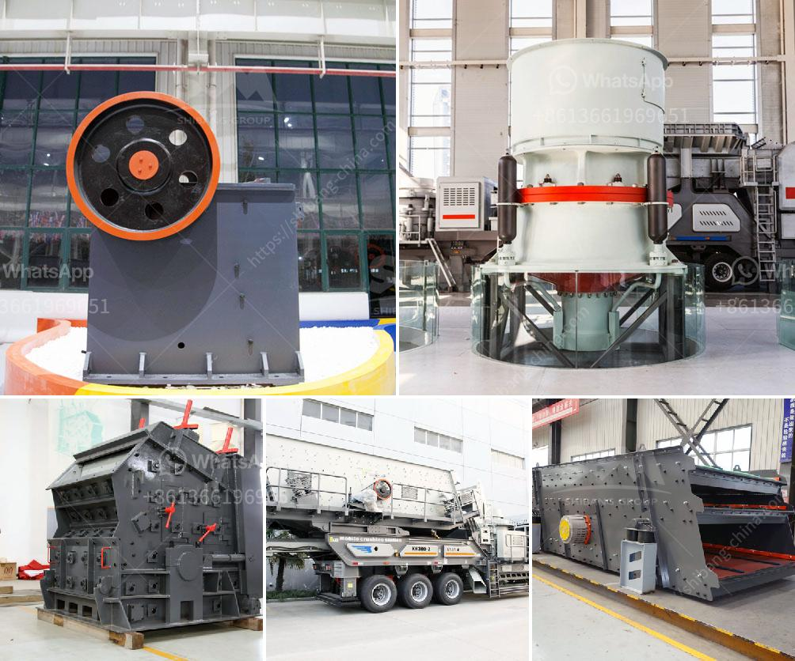

<h3>granite quarrying companies</h3>
Granite, with its unique patterns and durability, has become one of the most sought-after stones in construction and interior design. From elegant countertops to stunning floorings, this igneous rock has captured our attention and admiration. Behind the scenes, granite quarrying companies play a crucial role in unearthing this magnificent stone and preparing it for its various applications.

Granite quarrying companies are specialized enterprises that extract granite blocks from deposits deep within the earth's surface. These blocks are then refined and transformed into different shapes and sizes to suit the needs of architects, designers, and individuals alike. The process of quarrying granite, although labor-intensive, is well worth the effort due to the incredible value and versatility the stone offers.

Quarrying granite involves multiple stages that ensure the extraction of high-quality blocks. The first step begins with prospecting or exploring the land to locate potential granite deposits. Sophisticated geological techniques, such as aerial surveys, satellite imaging, and ground-penetrating radar, are employed to identify granite-rich areas with precision.

Once a suitable site is found, the extraction process starts with drilling and blasting. Controlled explosions are used to break up the granite bedrock into manageable pieces. This stage requires skilled technicians who carefully plan and execute the blasts to minimize environmental impact and ensure the safety of the workers.

After the blasting, large excavators and loaders are employed to remove the fragmented granite blocks from the quarry floor. These blocks, weighing several tons, are then transported to the processing area, where they undergo further refinement. Each block is meticulously examined to ensure its quality and suitability for different applications.

Next comes the stone cutting process, where modern machinery, like gang saws and diamond wire saws, slice the granite blocks into slabs of various thicknesses. This precise cutting allows for flexibility in design and further enhances the stone's adaptability to different architectural styles. Some quarrying companies even offer customized cuts to meet the specific requirements of their clients.

Once the slabs are cut, they go through a polishing process, which brings out the granite's natural beauty and gives it a lustrous finish. Highly-skilled craftsmen use diamond abrasives and polishing pads to achieve the desired smoothness and shine, ensuring that every slab meets the highest standards of quality.

While the extraction and refinement processes are crucial, granite quarrying companies also prioritize sustainable practices. Many companies work diligently to minimize their environmental footprint by reclaiming the land and following strict regulations regarding waste management and water usage. They understand the importance of preserving the earth's resources for future generations.

Furthermore, granite quarrying companies often play an essential role in the local economy. These operations provide jobs to skilled workers, stimulate business activities in surrounding areas, and contribute to the overall development of the community. As a result, the revenue generated from the sale of granite benefits not only the companies but also the regions in which they operate.

In conclusion, granite quarrying companies play an integral part in bringing the beauty and versatility of granite to our everyday lives. Through meticulous extraction, refinement, and sustainable practices, they ensure that this incredible stone reaches the hands of architects, designers, and homeowners worldwide. Their commitment to quality and environmental stewardship is what enables us to incorporate the timeless elegance of granite into our homes and buildings, elevating the aesthetics and durability to new heights.
<h3>Contact us</h3><ul><li><strong>Whatsapp:&nbsp;<a href="https://wa.me/8613661969651">+8613661969651</a></strong></li><li><a href="https://swt.shibang-china.com/?git&amp;zhl&amp;granite quarrying companies"><strong>Online Service(chat now)</strong></a></li></ul><h3>Related</h3><ul><li><a href='project report of lime processing unit.md'>project report of lime processing unit</a></li><li><a href='clay crusher price.md'>clay crusher price</a></li><li><a href='lime stone screw conveyor.md'>lime stone screw conveyor</a></li><li><a href='grinding mill tecator cyclotec.md'>grinding mill tecator cyclotec</a></li><li><a href='gravel cone crusher for sale.md'>gravel cone crusher for sale</a></li></ul>