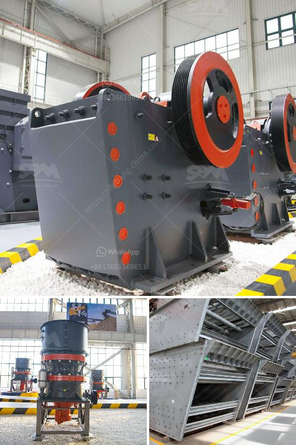

<h3>granite rock breaking machine manufacturer in mlaysia</h3>
Granite is a type of igneous rock that is widely used in construction due to its durability and aesthetic appeal. However, processing granite into usable building materials requires specialized equipment, and this is where a granite rock breaking machine manufacturer in Malaysia can prove invaluable.

These machines are used to break large blocks of granite into smaller, more manageable pieces. They are typically used in quarries and stone processing plants, where large amounts of granite need to be processed on a daily basis. The machines employ various methods to break the granite, depending on the desired end product.

One of the main benefits of using a granite rock breaking machine is the significant increase in productivity and efficiency. These machines are designed to handle large volumes of granite, reducing the need for manual labor and speeding up the production process. This not only saves time and resources but also helps meet the growing demand for granite in the construction industry.

In addition to improved productivity, the use of a granite rock breaking machine also ensures more precise and consistent results. These machines are equipped with cutting-edge technology and advanced features that guarantee a uniform breakage pattern, resulting in high-quality granite pieces. This is crucial, as the appearance and quality of the granite will directly impact the final product and the satisfaction of the end consumer.

When choosing a granite rock breaking machine manufacturer in Malaysia, there are several factors to consider. First and foremost, the manufacturer should have a strong reputation in the industry, with a proven track record of delivering reliable and efficient machines. It is essential to do thorough research, read customer reviews, and visit the manufacturer's facilities to assess their capabilities and quality control measures.

Another crucial aspect to consider is the after-sales support provided by the manufacturer. A reputable manufacturer will offer comprehensive customer support, including installation, training, and maintenance services. This ensures that the machine operates at its optimum level, reducing downtime and minimizing potential issues that could affect production.

Furthermore, it is important to choose a manufacturer that offers customization options. Every granite quarry or stone processing plant has unique requirements, and a good manufacturer will be able to tailor the machine to meet these specific needs. This may include modifications to the machine's configuration, such as the size and power of the breaking mechanism, to ensure optimal performance in the given environment.

In conclusion, a reliable and efficient granite rock breaking machine manufacturer in Malaysia plays a crucial role in the granite industry. Their machines offer increased productivity, improved precision, and consistent results, all contributing to the growth and success of the construction sector. Therefore, investing in high-quality machines from a reputable manufacturer is vital for businesses that deal with granite on a regular basis.
<h3>Contact us</h3><ul><li><strong>Whatsapp:&nbsp;<a href="https://wa.me/8613661969651">+8613661969651</a></strong></li><li><a href="https://swt.shibang-china.com/?git&amp;zhl&amp;granite rock breaking machine manufacturer in mlaysia"><strong>Online Service(chat now)</strong></a></li></ul><h3>Related</h3><ul><li><a href='crusher plant in rajasthan.md'>crusher plant in rajasthan</a></li><li><a href='silica sand washing plant.md'>silica sand washing plant</a></li><li><a href='stone crushers in china.md'>stone crushers in china</a></li><li><a href='gravel making crusher.md'>gravel making crusher</a></li><li><a href='crusher rock for sale.md'>crusher rock for sale</a></li></ul>