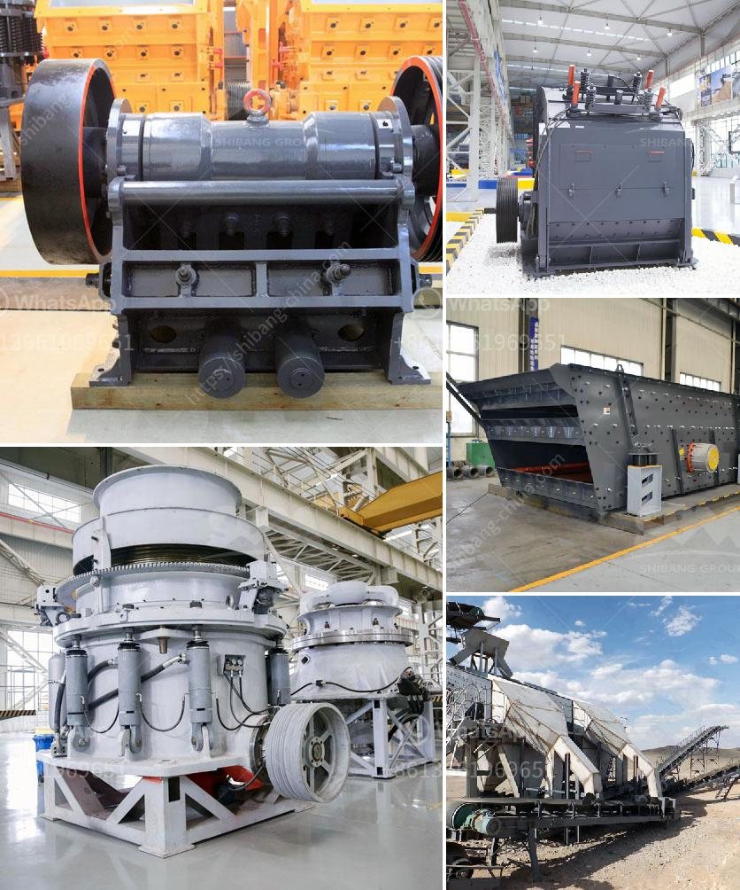

<h3>granite tiles processing machines</h3>
Granite tiles are a popular choice for flooring and wall cladding due to their durability, strength, and aesthetic appeal. However, before they reach our homes and businesses in their elegant form, granite tiles undergo a meticulous processing procedure. This process involves the use of various machines specifically designed for the precise cutting, shaping, and polishing of granite stone.

One of the key machines used in granite tile processing is the bridge saw. This large and sturdy machine utilizes a diamond blade to cut the granite slab into predetermined dimensions, ensuring a precise fit for the tiles. The bridge saw is especially useful for cutting large slabs into smaller, more manageable pieces.

After the cutting process, the granite tiles go through a calibration stage. Calibration machines are employed to grind the tiles down to a uniform thickness, resulting in a smooth and even surface. These machines use abrasive stones or diamond discs to remove any imperfections and ensure that all tiles are of the same thickness.

Another critical machine used in the granite tile processing industry is the edge profiling machine. This machine shapes the edges of the tiles to create different profiles such as beveled, round, or straight edges. By using various tools and cutting patterns, the edge profiling machine adds a touch of elegance to the granite tiles, enhancing their visual appeal.

To achieve a polished and glossy surface, granite tiles go through a final processing stage known as polishing. Polishing machines utilize abrasive pads or discs, along with water or a polishing compound, to gently buff and shine the tiles. This process enhances the natural shimmer and color of the granite, giving it a luxurious finish.

In conclusion, granite tile processing machines play a crucial role in transforming raw granite slabs into exquisite tiles. From the initial cutting and calibration stages to the final polishing process, each machine has a specific function that contributes to the high-quality end product. The combination of these machines and skilled craftsmanship ensure that granite tiles are not only durable but also a stunning addition to any space.
<h3>Contact us</h3><ul><li><strong>Whatsapp:&nbsp;<a href="https://wa.me/8613661969651">+8613661969651</a></strong></li><li><a href="https://swt.shibang-china.com/?git&amp;zhl&amp;granite tiles processing machines"><strong>Online Service(chat now)</strong></a></li></ul><h3>Related</h3><ul><li><a href='cement manufacturing process ppt.md'>cement manufacturing process ppt</a></li><li><a href='price of mobile crushing plant.md'>price of mobile crushing plant</a></li><li><a href='estimated cost for cement grinding mill.md'>estimated cost for cement grinding mill</a></li><li><a href='price of smallest chippings crusher plant.md'>price of smallest chippings crusher plant</a></li><li><a href='wet process cement.md'>wet process cement</a></li></ul>