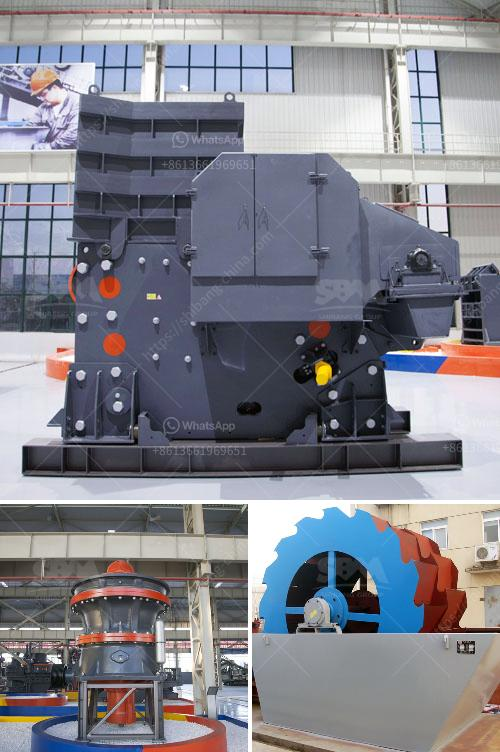

<h3>graphite beneficiation process</h3>
Graphite is a non-metallic mineral that is one of the important industrial minerals used in many applications, such as batteries, lubricants, refractories, and as a precursor to various graphene-based products. However, the purity and quality of natural graphite is often not high enough to meet the requirements of these applications. This is where the graphite beneficiation process comes into play.

The graphite beneficiation process is a complex and intricate process depending on the ore characteristics and the end-use of the graphite concentrate. It typically involves various steps such as crushing, milling, flotation, and drying. Each of these steps is carefully designed and implemented to ensure the highest possible recovery and purity of the graphite concentrate.

The first step in the graphite beneficiation process is crushing the ore into smaller particles to liberate the graphite flakes from the surrounding rock. This is usually done using crushers and mills, which reduce the ore to a manageable size. The next step is milling, which involves grinding the ore to even smaller particles, making it easier to separate the graphite flakes from the gangue minerals.

The third step is flotation, where various reagents are added to the graphite ore slurry to selectively separate the graphite from the unwanted impurities. This process relies on the hydrophobicity of graphite, which allows it to attach to air bubbles and float to the surface, while the hydrophilic gangue minerals sink. The graphite concentrate is then further dewatered and dried to remove any remaining moisture.

The final step in the graphite beneficiation process is purification, where the concentrate is subjected to additional treatments to remove any impurities and improve its purity. This may involve chemical or thermal treatments, such as acid leaching or high-temperature annealing, to enhance the properties of the graphite concentrate.

Overall, the graphite beneficiation process plays a crucial role in improving the purity and quality of natural graphite, making it suitable for various industrial applications. By carefully selecting the appropriate beneficiation techniques and optimizing the process parameters, the desired graphite concentrate can be obtained, meeting the specific requirements of end-users.
<h3>Contact us</h3><ul><li><strong>Whatsapp:&nbsp;<a href="https://wa.me/8613661969651">+8613661969651</a></strong></li><li><a href="https://swt.shibang-china.com/?git&amp;zhl&amp;graphite beneficiation process"><strong>Online Service(chat now)</strong></a></li></ul><h3>Related</h3><ul><li><a href='functions conical crusher.md'>functions conical crusher</a></li><li><a href='gypsum board making machine supplier.md'>gypsum board making machine supplier</a></li><li><a href='gravel making machine.md'>gravel making machine</a></li><li><a href='usine carbonate de calcium.md'>usine carbonate de calcium</a></li><li><a href='conveyor belt distributor in nigeria.md'>conveyor belt distributor in nigeria</a></li></ul>