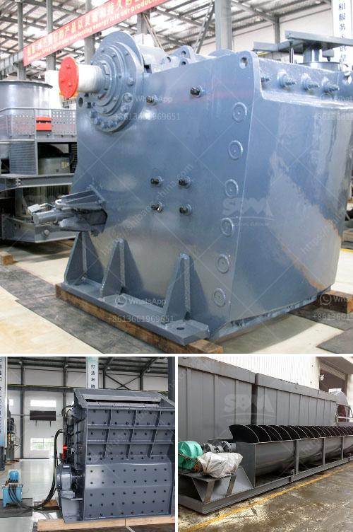

<h3>graphite beneficiation</h3>
Graphite beneficiation is the process of extracting the impurities from the pure form of graphite. As the mineral is formed of carbon atoms only, its purity gives it unique properties that make it ideal for multiple applications. In recent years, graphite has become a strategic mineral due to its increasing demand in various industries such as electronics, energy storage, and aerospace.

The beneficiation process aims to improve the quality and purity of graphite ore. Graphite beneficiation techniques depend on the nature and association of gangue minerals present in the ore body. It can be enriched by flotation, gravity separation, and electrostatic separation methods. However, the purity is also influenced by the geological and mineralogical characteristics of the ore, making each deposit unique and requiring specific beneficiation approaches.

In the case of flake graphite, which is the most commonly mined variety, the beneficiation process starts with crushing the ore into a fine powder. This is then followed by multiple stages of grinding and flotation to separate the graphite flakes and impurities. The finely ground ore is mixed with water and various reagents to create a pulp that undergoes flotation. During this process, the hydrophobic graphite particles attach to air bubbles and float to the surface, while the hydrophilic gangue minerals sink. The resulting concentrate is further purified to produce high-purity graphite through additional refining steps.

In contrast, amorphous graphite beneficiation involves crushing and grinding the ore to liberate the graphite flakes. It is then subjected to froth flotation, where the graphite particles are separated from the gangue minerals based on their hydrophobicity. The concentrate is collected and further processed to remove any remaining impurities, resulting in a high-quality product suitable for applications requiring graphite with a lower purity.

In recent years, there has been a growing interest in developing environmentally friendly and sustainable beneficiation methods. One such approach is the use of biotechnology, which involves the application of microorganisms to selectively separate graphite from impurities. Microorganisms, such as bacteria and fungi, can selectively attach to specific minerals, aiding in their separation during flotation. This approach reduces the need for traditional chemical reagents, contributing to a greener mining industry.

Furthermore, advancements in beneficiation technologies are aimed at increasing the efficiency of graphite extraction while minimizing water usage and energy consumption. These advancements include the use of advanced flotation cells, gravity separation devices, and state-of-the-art grinding equipment. By optimizing the beneficiation process, the overall environmental impact of graphite mining can be reduced significantly.

Graphite beneficiation plays a crucial role in ensuring the sustainability of the graphite industry. As demand for graphite continues to rise, it is essential to develop efficient processes for extracting high-purity graphite with minimal environmental impact. Through ongoing research and technological advancements, the future of graphite beneficiation looks promising, with potential innovations that can further enhance its applications and contribute to a more sustainable and responsible mining industry.
<h3>Contact us</h3><ul><li><strong>Whatsapp:&nbsp;<a href="https://wa.me/8613661969651">+8613661969651</a></strong></li><li><a href="https://swt.shibang-china.com/?git&amp;zhl&amp;graphite beneficiation"><strong>Online Service(chat now)</strong></a></li></ul><h3>Related</h3><ul><li><a href='cost of an copper ore crusher.md'>cost of an copper ore crusher</a></li><li><a href='to buy second hand cement plant in india.md'>to buy second hand cement plant in india</a></li><li><a href='ball mill screen 200 tph.md'>ball mill screen 200 tph</a></li><li><a href='ball mill education.md'>ball mill education</a></li><li><a href='application of ball mill in industries.md'>application of ball mill in industries</a></li></ul>