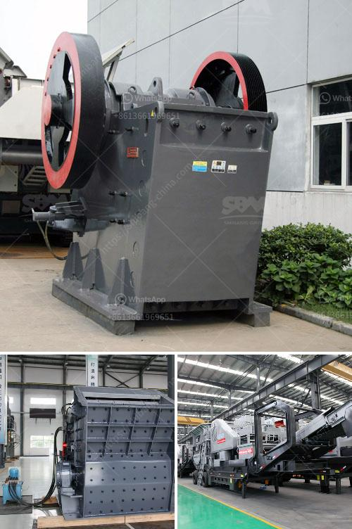

<h3>graphite crusher products</h3>
Graphite, a naturally occurring form of carbon, has a wide range of applications due to its unique properties. It is widely used in the manufacturing of various products, including pencils, lubricants, batteries, and even smartphones. One crucial aspect of graphite utilization is its crushing process, which aims to reduce the size of graphite ore particles and make them suitable for further processing. In this article, we will discuss the significance of graphite crusher products and their role in various industries.

Graphite crusher products refer to machinery that breaks down graphite materials into smaller particles, facilitating their subsequent use. These crushers are typically designed to handle large quantities of graphite ore and reduce them to a more manageable size. By crushing the graphite ore, the surface area of the particles increases, allowing for better chemical reactions during subsequent processing stages.

There are several types of crushers used for graphite crushing, including jaw crushers, impact crushers, and cone crushers. Each type offers different advantages, depending on the specific requirements of the application. Jaw crushers are ideal for primary crushing and are known for their durability and high processing capacity. Impact crushers, on the other hand, are best suited for secondary or tertiary crushing, offering a more refined product size. Cone crushers combine the benefits of both jaw and impact crushers and are often used in the final stages of graphite processing.

Graphite crusher products play a crucial role in various industries. In the steel manufacturing industry, graphite electrodes, made from high-quality graphite, are used in electric arc furnaces to generate the intense heat required for steel production. These electrodes are prepared by crushing and shaping graphite blocks, making graphite crushers essential equipment in this sector.

Moreover, the rapid growth of the lithium-ion battery industry, driven by the surging demand for electric vehicles and renewable energy storage systems, has increased the need for graphite crusher products. Graphite is a critical component of lithium-ion batteries, and the crushing process is necessary to produce the graphite powder used in battery anodes.

In conclusion, graphite crusher products have become essential machinery in various industries due to the widespread applications of graphite. By breaking down graphite ore into smaller particles, these crushers enable efficient processing and utilization of graphite in steel manufacturing, battery production, and numerous other sectors. The continuous advancement of graphite crusher technology will further enhance the processing efficiency and quality of graphite products, contributing to the growth of these industries and the overall development of our society.
<h3>Contact us</h3><ul><li><strong>Whatsapp:&nbsp;<a href="https://wa.me/8613661969651">+8613661969651</a></strong></li><li><a href="https://swt.shibang-china.com/?git&amp;zhl&amp;graphite crusher products"><strong>Online Service(chat now)</strong></a></li></ul><h3>Related</h3><ul><li><a href='defination of machine aggregate crusher.md'>defination of machine aggregate crusher</a></li><li><a href='crushing plants for sale in south africa.md'>crushing plants for sale in south africa</a></li><li><a href='kaolin processing equipment fabricators in nigeria.md'>kaolin processing equipment fabricators in nigeria</a></li><li><a href='ball mill screen 200 tph.md'>ball mill screen 200 tph</a></li><li><a href='hp series cone crusher.md'>hp series cone crusher</a></li></ul>