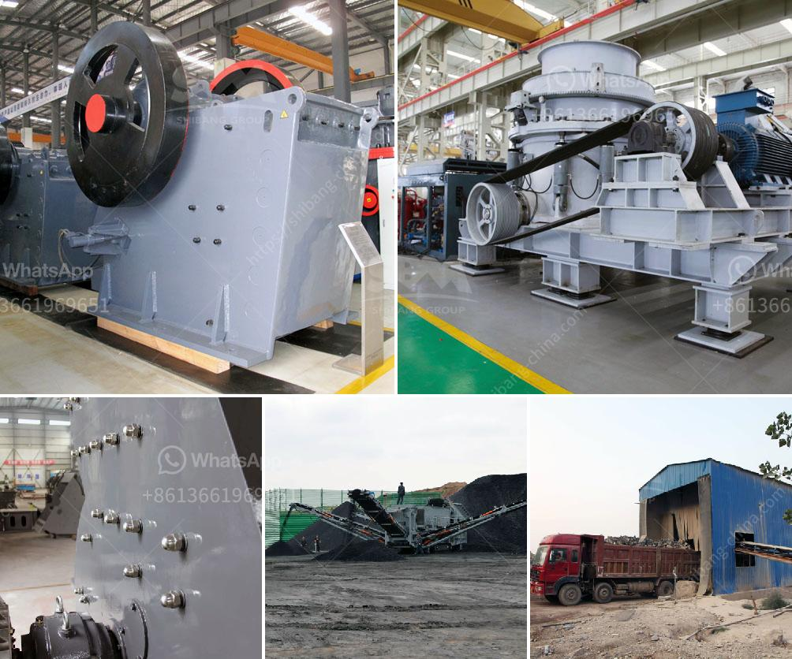

<h3>graphite mining process</h3>
Graphite is an excellent electrical conductor, and its high thermal stability and lubricity make it a crucial component in various industrial applications. It is used extensively in the manufacturing of electrodes, batteries, refractories, lubricants, and other products. With the increasing demand for these materials, the graphite mining industry has witnessed significant growth.

The graphite mining process involves extracting graphite-rich ore from underground or open-pit mines, treating it to remove impurities, and then creating the graphite product suitable for use in various applications. In this article, we will discuss the typical steps involved in this process.

The first step in the graphite mining process involves extracting graphite-rich ore from geologic formations that contain graphite deposits. These formations range from large scale deposits with high ore grades to small-scale occurrences dispersed over large areas. The extraction method largely depends on the ore characteristics, scale of mining operations, and available technology.

For large-scale operations, underground mining is the preferred method. This involves creating tunnels and shafts into the ground, allowing access to the graphite ore deposits. Miners then use equipment such as explosives, excavators, and underground haul trucks to extract the ore.

In contrast, smaller-scale operations may utilize open-pit mining, which involves removing the overlying rock and soil to expose the graphite ore. This type of mining is less expensive but may require post-mining rehabilitation due to the disturbance of the ecosystem.

Once the graphite ore is extracted, it goes through a series of beneficiation processes to remove impurities and increase its carbon content. The beneficiation process typically includes crushing the ore into small fragments, followed by grinding it into a fine powder.

Next, various techniques such as froth flotation, gravity separation, or magnetic separation are employed to concentrate the graphite ore. These methods exploit the differences in physical and chemical properties between graphite and impurities.

After the initial beneficiation, the graphite concentrate undergoes further refining to produce high-purity graphite products. The refining process may involve multiple steps, such as chemical leaching, thermal treatment, and micronization.

Chemical leaching is performed to remove residual impurities and unwanted elements. This process utilizes acid or alkaline solutions to dissolve the impurities without affecting the graphite structure.

Thermal treatment, also known as annealing, involves exposing the graphite concentrate to high temperatures to remove any remaining volatile substances. This increases the carbon content and improves the properties of the final product.

Micronization is the final refining step, where the graphite concentrate is ground to achieve the desired particle size distribution. This process enhances the purity and performance of the graphite product.

It is important to note that the graphite mining process can have significant environmental impacts. Open-pit mining may disrupt the local ecosystem and lead to soil erosion and water pollution. The refining process may generate waste materials, including tailings and wastewater, which must be properly managed to prevent environmental contamination.

To mitigate these concerns, mining companies implement various environmental management practices, such as proper waste disposal, reclamation of disturbed areas, and water treatment systems. Additionally, efforts are underway to develop more sustainable graphite mining techniques, including the use of renewable energy sources and employing more efficient mining equipment.

In conclusion, the graphite mining process involves extracting graphite-rich ore, followed by beneficiation and refining processes to produce high-purity graphite products. While this industry plays a crucial role in various manufacturing sectors, it is essential to address the environmental concerns associated with mining and refining operations. By adopting sustainable practices and embracing technological advancements, the graphite mining industry can continue to thrive while minimizing its impact on the environment.
<h3>Contact us</h3><ul><li><strong>Whatsapp:&nbsp;<a href="https://wa.me/8613661969651">+8613661969651</a></strong></li><li><a href="https://swt.shibang-china.com/?git&amp;zhl&amp;graphite mining process"><strong>Online Service(chat now)</strong></a></li></ul><h3>Related</h3><ul><li><a href='induatrial mill crusher supplier.md'>induatrial mill crusher supplier</a></li><li><a href='price of crusher.md'>price of crusher</a></li><li><a href='quartz mining equipments.md'>quartz mining equipments</a></li><li><a href='ball mill specification limestone grinding.md'>ball mill specification limestone grinding</a></li><li><a href='stone crusher for concrete.md'>stone crusher for concrete</a></li></ul>