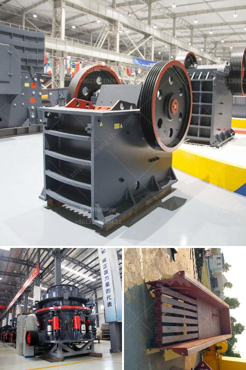

<h3>graphite powder making machine</h3>
Graphite is a versatile industrial mineral with numerous applications in various industries. The demand for graphite powder is on the rise due to the increasing use of this mineral in various sectors such as batteries, lubricants, refractories, and electrical components. To meet this growing demand, a graphite powder making machine has emerged as a critical tool in the graphite powder manufacturing process.

Graphite powder making machines are used to pulverize graphite materials into fine powders. These machines are a key element in the graphite powder production process, as they help in grinding graphite ores into a fine powder, which can then be used as a raw material in various industries.

One of the main advantages of using a graphite powder making machine is its ability to produce high-quality graphite powder with excellent purity and fineness. These machines are designed to finely grind graphite ores, ensuring that the final product meets the desired specifications and quality standards. The finely ground graphite powder is also characterized by its low impurity content, which makes it suitable for use in demanding applications.

Another significant advantage of using a graphite powder making machine is its efficiency and productivity. These machines are designed to operate at high speeds, ensuring that the graphite ores are ground quickly and efficiently. As a result, manufacturers can produce a large quantity of graphite powder in a short period, reducing production time and costs. This increased efficiency has contributed to the exponential growth of the graphite industry, as manufacturers can now meet the rising demand for graphite powder more effectively.

The graphite powder making machine not only benefits manufacturers but also plays a crucial role in promoting environmental sustainability. Traditional graphite powder production methods involve using harsh chemicals and generating a substantial amount of waste. However, with the advancement of graphite powder making machines, manufacturers now have a more environmentally friendly option. These machines use sustainable grinding techniques and minimize the use of chemicals, resulting in reduced environmental impact.

In conclusion, the graphite powder making machine has emerged as an essential tool in the graphite powder manufacturing process. Its ability to produce high-quality, finely ground graphite powder with excellent purity and efficiency has revolutionized the graphite industry. With the increasing demand for graphite across various industries, the graphite powder making machine has become a key player in meeting this demand.

As technology advances, we can expect further innovation in graphite powder making machines, leading to improved efficiency, productivity, and environmental sustainability. This will not only benefit manufacturers but also contribute to the development of greener and more sustainable industries. With the continued growth of graphite applications, the graphite powder making machine industry is poised to become even more significant in the coming years.
<h3>Contact us</h3><ul><li><strong>Whatsapp:&nbsp;<a href="https://wa.me/8613661969651">+8613661969651</a></strong></li><li><a href="https://swt.shibang-china.com/?git&amp;zhl&amp;graphite powder making machine"><strong>Online Service(chat now)</strong></a></li></ul><h3>Related</h3><ul><li><a href='copper manufacturing process.md'>copper manufacturing process</a></li><li><a href='lates hammer mill.md'>lates hammer mill</a></li><li><a href='raymond roller mills in kolkata.md'>raymond roller mills in kolkata</a></li><li><a href='mobile gold processing plant south africa.md'>mobile gold processing plant south africa</a></li><li><a href='two roll mill supply in sri lanka.md'>two roll mill supply in sri lanka</a></li></ul>