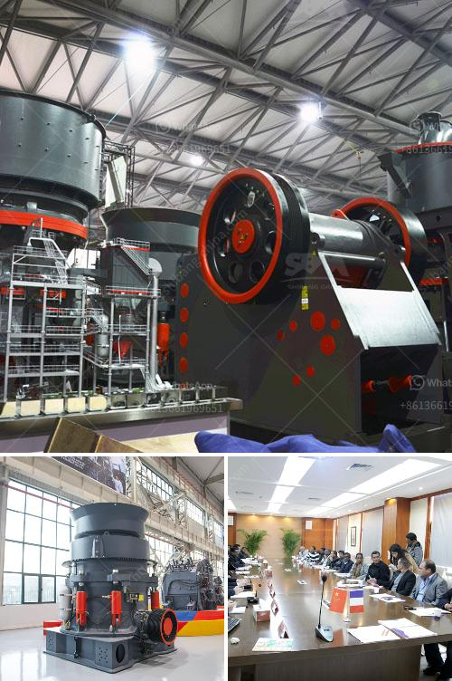

<h3>gravel and sand mining equipment</h3>
Gravel and sand mining is a lucrative industry that involves the extraction of minerals such as sand, gravel, and limestone from the earth's crust. These minerals are widely used in various construction and infrastructure projects due to their durability and strength. With the increasing demand for these materials, the need for efficient and reliable mining equipment has also grown.

Gravel and sand mining equipment plays a crucial role in the process of extracting these minerals. Building materials like concrete, asphalt, and glass all rely on sand and gravel for their production. Without a reliable source of these materials, construction projects would come to a standstill. Therefore, mining equipment specifically designed for extracting and crushing gravel and sand is essential to ensure the smooth operation of these projects.

When it comes to gravel and sand mining equipment, there are several types that are commonly used. One of the most common is a bulldozer. These powerful machines are used to clear the land, remove vegetation, and create a level and stable surface for mining. They are also used to push the materials onto conveyors or trucks for transportation.

Other types of equipment used in gravel and sand mining include excavators, loaders, and crushers. Excavators are used to dig deep into the earth to extract the minerals, while loaders are used to move the extracted materials to the desired location. Crushers, on the other hand, are used to break down large rocks into smaller pieces, suitable for further processing.

Efficiency and durability are crucial factors when selecting gravel and sand mining equipment. Manufacturers are continually working to develop equipment that can withstand the harsh conditions of mining sites and maximize productivity. Equipment with advanced features, such as remote control operations and automated systems, can significantly improve efficiency and reduce labor costs.

In conclusion, gravel and sand mining equipment plays a vital role in meeting the increasing demand for construction materials. The extraction and processing of these minerals require specialized equipment that is efficient, durable, and capable of handling the demands of mining sites. Manufacturers are continually innovating to provide the industry with more advanced equipment that can ensure the sustainable supply of gravel and sand for construction purposes.
<h3>Contact us</h3><ul><li><strong>Whatsapp:&nbsp;<a href="https://wa.me/8613661969651">+8613661969651</a></strong></li><li><a href="https://swt.shibang-china.com/?git&amp;zhl&amp;gravel and sand mining equipment"><strong>Online Service(chat now)</strong></a></li></ul><h3>Related</h3><ul><li><a href='usine carbonate de calcium.md'>usine carbonate de calcium</a></li><li><a href='hammer mills used in gold mining.md'>hammer mills used in gold mining</a></li><li><a href='rock grinding mill price in india.md'>rock grinding mill price in india</a></li><li><a href='lime stone screw conveyor.md'>lime stone screw conveyor</a></li><li><a href='quartz bulk supplier sri lanka.md'>quartz bulk supplier sri lanka</a></li></ul>