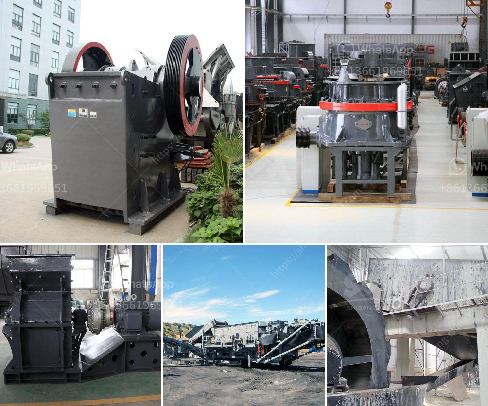

<h3>gravel cone crusher for sale</h3>
Gravel, as well as limestone, is a common construction aggregate. It is also widely used in road and building construction as a filling material. Aggregate is a necessary component for concrete production, which is why gravel is always in high demand. Unfortunately, the extraction of natural resources has its limits, and it often leads to environmental degradation.

To address this issue, gravel cone crushers have emerged as the ideal crushing equipment. These machines offer a cost-effective alternative to traditional gravel extraction methods while also protecting the environment. Moreover, they can significantly improve the efficiency of the gravel production process, thereby reducing costs and increasing profits.

A gravel cone crusher is similar in operation to a traditional gyratory crusher. With a steep cone angle, they deliver a coarser product and require less energy to operate. As a result, the cost per ton of crushed material is reduced, making them an attractive option for gravel producers. Additionally, these crushers feature a hydraulic overload protection system that ensures the safety of the machine and prevents damage to other equipment.

One of the advantages of gravel cone crushers is their versatility. They can handle a wide range of materials, including gravel, limestone, basalt, and even ores. This versatility makes them suitable for various applications, such as road construction, aggregate production, and mining operations. Whether it's a small-scale project or a large-scale operation, a gravel cone crusher can meet the requirements efficiently.

When searching for a gravel cone crusher for sale, it's essential to consider several factors. First, choose a reputable manufacturer known for producing high-quality and durable equipment. Longevity is crucial, especially when dealing with large quantities of gravel. Second, evaluate the crusher's performance by checking its power and capacity specifications. The machine should be able to meet your production demands without causing delays or bottlenecks.

Another important consideration is the maintenance of the crusher. Look for models that are easy to maintain and come with readily available spare parts. This ensures that your equipment operates at its peak performance and minimizes downtime. Some manufacturers even offer training programs for operators, ensuring that they can efficiently operate and maintain the machine.

Additionally, consider the cost of the gravel cone crusher. While the initial investment may seem significant, it is essential to evaluate the long-term benefits and cost savings. A high-quality crusher can provide substantial returns over its lifespan, reducing operating costs and increasing profitability.

In conclusion, a gravel cone crusher is a cost-effective solution for gravel production. These machines not only reduce environmental impact but also enhance efficiency and profitability. When searching for a gravel cone crusher for sale, select a reputable manufacturer, evaluate the performance and maintenance requirements, and consider the long-term cost benefits. By making an informed decision, you can find the perfect crusher to meet your gravel production needs and contribute to sustainable construction practices.
<h3>Contact us</h3><ul><li><strong>Whatsapp:&nbsp;<a href="https://wa.me/8613661969651">+8613661969651</a></strong></li><li><a href="https://swt.shibang-china.com/?git&amp;zhl&amp;gravel cone crusher for sale"><strong>Online Service(chat now)</strong></a></li></ul><h3>Related</h3><ul><li><a href='buy quarry machine from europe.md'>buy quarry machine from europe</a></li><li><a href='conveyor belts supplier malaysia.md'>conveyor belts supplier malaysia</a></li><li><a href='stone grinder machine for marble.md'>stone grinder machine for marble</a></li><li><a href='precipitated calcium carbonate process.md'>precipitated calcium carbonate process</a></li><li><a href='quartz bulk supplier sri lanka.md'>quartz bulk supplier sri lanka</a></li></ul>