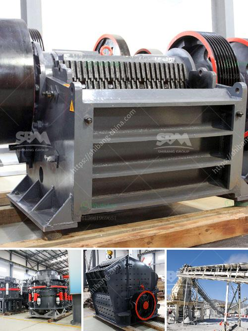

<h3>gravel conveyor belt</h3>
The gravel industry plays a vital role in construction and infrastructure development projects worldwide. As demand for gravel continues to rise, so does the need for efficient and reliable methods of transporting this essential material. One such method that has proven to be highly effective is the gravel conveyor belt.

A gravel conveyor belt is a system that consists of two or more pulleys with a continuous loop of material – in this case, gravel - circling around them. These pulleys are powered, moving the belt and transporting the gravel from one location to another. Whether it's on a construction site, quarry, or mining operation, a gravel conveyor belt is an indispensable tool for carrying out various tasks.

One of the key advantages of using a gravel conveyor belt is its efficient operation. Manual transportation of gravel can be extremely time-consuming and physically demanding. With a conveyor belt system in place, workers can focus on other critical tasks, as the belt autonomously moves the gravel from one place to another. This not only saves time and effort but also increases overall productivity.

The convenience provided by a gravel conveyor belt is unparalleled. These systems can be set up in various configurations to suit different site requirements. They can be adjusted to different inclines and heights to ensure that the gravel reaches the desired destination, whether it's a truck, silo, or another conveyance system. Additionally, conveyor belts can be designed to transport various types of gravel, ranging from fine to coarse, ensuring versatility and adaptability to different projects.

Furthermore, safety is a paramount concern on any worksite, and the implementation of a gravel conveyor belt can help mitigate risks. Manual handling of heavy gravel, especially over long distances, increases the likelihood of accidents and injuries. The use of conveyor belts minimizes the need for manual labor, significantly reducing the potential for incidents. Workers can also operate the system remotely, allowing them to maintain a safe distance from the moving gravel.

In addition to improving safety, conveyor belt systems also offer environmental benefits. By automating the gravel transportation process, conveyor belts reduce the need for heavy machinery, such as dump trucks or loaders, which consume fuel and emit harmful emissions. This not only helps in reducing carbon footprint but also contributes to a cleaner and greener work environment.

Moreover, gravel conveyor belts are designed to withstand harsh conditions and heavy loads, ensuring durability and longevity. Requiring minimal maintenance, these systems offer a cost-effective solution for transporting large quantities of gravel. They perform consistently, reducing downtime and minimizing the need for frequent repairs.

In conclusion, a gravel conveyor belt is an ideal choice for the transportation of gravel in construction and infrastructure projects. Its efficiency, convenience, safety, and environmental benefits make it a valuable tool in the industry. With the ability to transport large quantities of material over long distances, these systems have revolutionized the way gravel is moved on worksites, boosting productivity and improving overall project outcomes.
<h3>Contact us</h3><ul><li><strong>Whatsapp:&nbsp;<a href="https://wa.me/8613661969651">+8613661969651</a></strong></li><li><a href="https://swt.shibang-china.com/?git&amp;zhl&amp;gravel conveyor belt"><strong>Online Service(chat now)</strong></a></li></ul><h3>Related</h3><ul><li><a href='grinding mills supplier in gujranwala pakistan.md'>grinding mills supplier in gujranwala pakistan</a></li><li><a href='gravel conveyor belt.md'>gravel conveyor belt</a></li><li><a href='coal grinding machinery manufacture in india.md'>coal grinding machinery manufacture in india</a></li><li><a href='clinker crsher plant for sale.md'>clinker crsher plant for sale</a></li><li><a href='crushers in saudi arabia.md'>crushers in saudi arabia</a></li></ul>