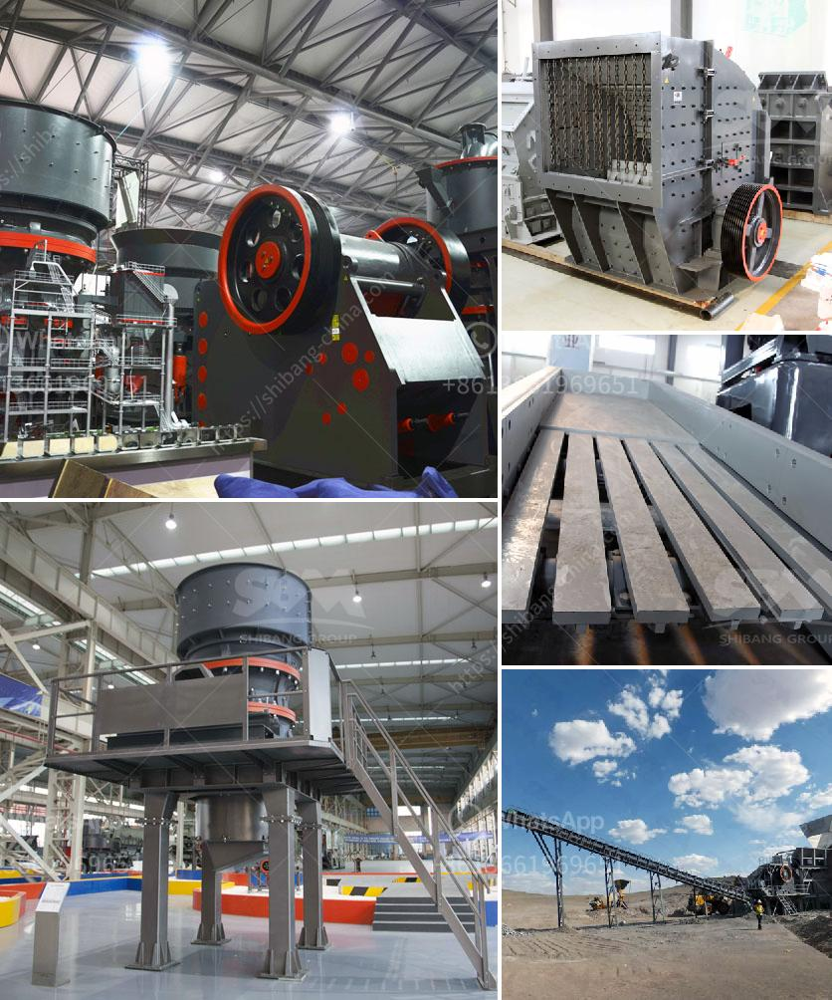

<h3>gravel crusher prices philippines</h3>
The Philippines is known for its mineral resources, making it a major supplier of various types of metals and minerals to the global market. Among these resources, gravel is one of the most abundant and in-demand materials used in construction projects.

Gravel crushers play a crucial role in breaking down the large rocks into smaller sizes, making it easier to transport and use for different purposes. However, the prices of gravel crushers in the Philippines vary greatly depending on factors such as the type, capacity, and supplier.

With the rising demand for quality construction materials, the market for gravel crushers in the Philippines has become quite competitive. This increased competition has resulted in a wide range of prices being offered by different suppliers. Generally, prices for gravel crushers in the Philippines can range from $3,000 to $30,000.

The price of a gravel crusher primarily depends on the capacity and the type of machine. Some factors that may affect the price include the size of the machine required, the type of material it will be used for, and the location of the supplier. Additionally, the brand and reputation of the supplier can also influence the price range.

When choosing a gravel crusher supplier in the Philippines, it is essential to consider not only the price but also the quality of the machine. Investing in a high-quality gravel crusher can save you money in the long run as it will require less maintenance and repairs, ensuring maximum efficiency and productivity for your construction projects.

To find the best gravel crusher prices in the Philippines, it is advisable to research and compare prices from different suppliers. This can be done by reaching out to multiple suppliers and requesting price quotations based on your specific requirements. By doing so, you can make an informed decision while considering the overall value and benefit each supplier offers.

In conclusion, with the Philippines being a major producer of gravel, the prices of gravel crushers vary greatly in the market. It is essential to consider factors such as capacity, type of machine, and supplier reputation when determining the price range. By carefully researching and comparing prices, you can find the best gravel crusher that meets your construction needs within your budget.
<h3>Contact us</h3><ul><li><strong>Whatsapp:&nbsp;<a href="https://wa.me/8613661969651">+8613661969651</a></strong></li><li><a href="https://swt.shibang-china.com/?git&amp;zhl&amp;gravel crusher prices philippines"><strong>Online Service(chat now)</strong></a></li></ul><h3>Related</h3><ul><li><a href='crusher stone crusher 4 ton.md'>crusher stone crusher 4 ton</a></li><li><a href='sand making machine application.md'>sand making machine application</a></li><li><a href='sell stone crusher crushing plant feeder screen conveyors.md'>sell stone crusher crushing plant feeder screen conveyors</a></li><li><a href='ball mill for sand and gravel.md'>ball mill for sand and gravel</a></li><li><a href='rock crushing machine speed limit.md'>rock crushing machine speed limit</a></li></ul>