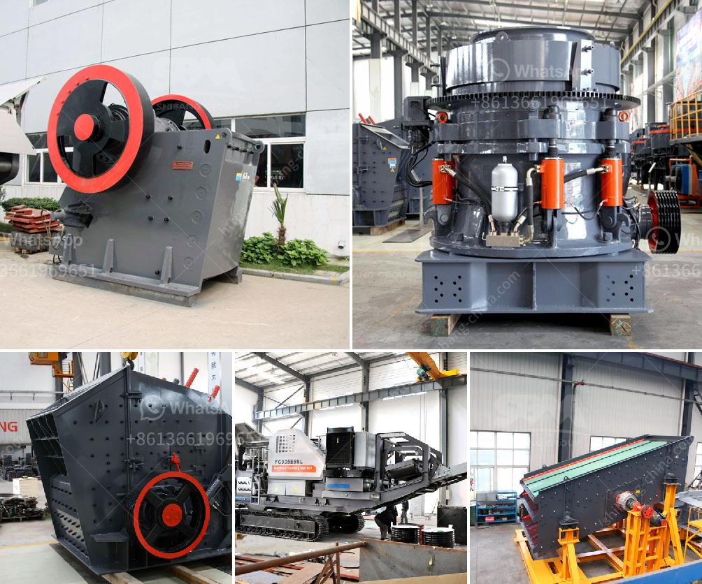

<h3>gravel making crusher</h3>
The construction industry is experiencing a paradigm shift with the introduction of innovative technologies and equipment. Among these advancements, gravel making crushers have emerged as game-changers. These machines are transforming the way construction companies and contractors approach projects that involve the use of gravel. With their efficiency, affordability, and environmental benefits, gravel making crushers have become an indispensable tool in the construction industry.

Gravel making crushers are engineered to break down large rocks into smaller, more manageable sizes, suitable for construction purposes. They operate with a high level of precision, allowing for consistent output and superior quality of gravel. These machines come in various sizes and configurations to meet the specific requirements of different projects.

With the ability to process large quantities of gravel at a fast pace, gravel making crushers significantly enhance productivity on construction sites. They minimize the need for manual labor and reduce the time spent on the crushing process, leading to increased efficiency and streamlined operations. Moreover, the uniformity and consistency in the gravel produced by these crushers ensure better quality construction work.

Traditionally, gravel extraction involved renting heavy machinery or outsourcing the crushing process to specialized companies. Both options were costly and time-consuming. With gravel making crushers, construction companies can save significant amounts of money by eliminating these intermediaries and having control over the entire production process.

Many gravel making crushers are designed to be highly portable, enabling contractors to move them easily between work sites. This mobility eliminates transportation costs and reduces project schedules. The affordability and low maintenance requirements of these machines, compared to alternative options, make them a cost-effective solution for construction projects of all sizes.

In addition to their efficiency and affordability, gravel making crushers also offer environmental benefits. The traditional extraction and production processes for gravel involved the destruction of natural habitats, causing ecological damage. Gravel making crushers mitigate these issues as they crush rocks within a controlled environment, minimizing disruption to surrounding ecosystems.

Furthermore, gravel making crushers can recycle and repurpose construction waste, reducing the burden on landfills. By recycling gravel onsite, construction projects can significantly reduce their carbon footprint and contribute to sustainability goals.

Gravel making crushers have become a key asset in the construction industry, revolutionizing the way gravel is sourced, processed, and utilized. These machines bring numerous advantages to contractors, including enhanced efficiency, cost-effectiveness, and environmental sustainability.

As the demand for gravel continues to rise, the adoption of gravel making crushers will likely become more widespread. Construction companies can leverage these innovative machines to optimize their operations, reduce costs, and improve the quality of their projects.

Overall, the introduction of gravel making crushers has paved the way for more sustainable and efficient construction practices. The industry is transitioning towards a greener and more productive future with these tools, ensuring that the construction sector remains at the forefront of technological advancements.
<h3>Contact us</h3><ul><li><strong>Whatsapp:&nbsp;<a href="https://wa.me/8613661969651">+8613661969651</a></strong></li><li><a href="https://swt.shibang-china.com/?git&amp;zhl&amp;gravel making crusher"><strong>Online Service(chat now)</strong></a></li></ul><h3>Related</h3><ul><li><a href='german jaw crusher manufacturers.md'>german jaw crusher manufacturers</a></li><li><a href='gold separating machine for sale in south africa.md'>gold separating machine for sale in south africa</a></li><li><a href='industrial vibrator feeder.md'>industrial vibrator feeder</a></li><li><a href='stone hammer mill machine.md'>stone hammer mill machine</a></li><li><a href='jaw crusher manufactures in saudi.md'>jaw crusher manufactures in saudi</a></li></ul>