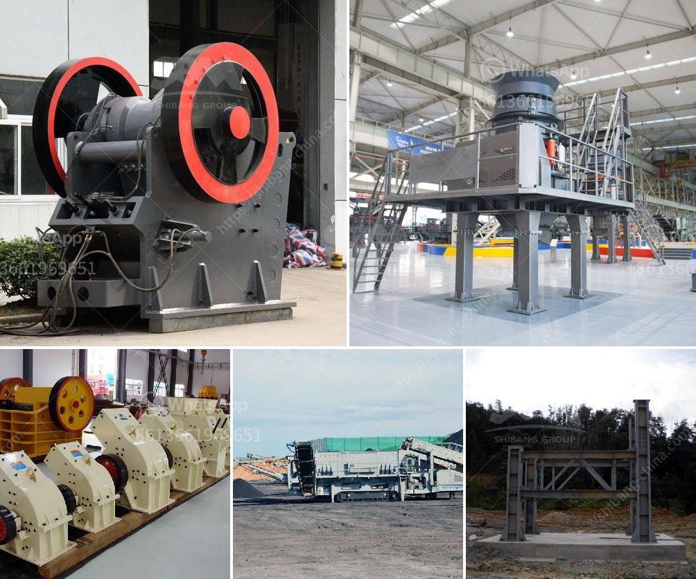

<h3>gravel making machine</h3>
The construction industry is one of the largest and fastest-growing sectors worldwide. With the increasing need for infrastructure development and urbanization, the demand for construction materials such as gravel is also on the rise. Gravel, a vital component in building roads, foundations, and concrete structures, plays a significant role in the construction process. In recent years, the introduction of gravel making machines has revolutionized the way gravel is produced, leading to efficiency, cost savings, and improved quality.

A gravel making machine, also known as a stone crusher, is a specially designed machine used for breaking down the large rocks into smaller aggregates. These machines are typically used in the mining industry to crush and grind ores into smaller particles. However, their adaptability and versatility have made them indispensable in the construction industry for producing gravel.

One of the key advantages of gravel making machines is their ability to process a wide range of materials, from limestone and granite to basalt and sandstone. This flexibility allows contractors and construction companies to source materials locally, reducing transportation costs and environmental impact. Additionally, with the ability to control the size and shape of the output, these machines provide more consistent and uniform gravel, meeting the required specifications.

Gravel making machines come in various sizes and types, including jaw crushers, impact crushers, cone crushers, and vibrating screens. Each type serves a specific purpose in the process of gravel production. Jaw crushers, for example, are ideal for primary crushing and breaking down large rocks into smaller sizes. Impact crushers, on the other hand, are more suitable for secondary crushing and producing finer aggregates. Cone crushers are often used for tertiary crushing and shaping the gravel particles into a more cubical shape.

Another significant advantage of gravel making machines is their efficiency and productivity. With advanced technology and automation, these machines can process large volumes of materials in a short period. This saves time and labor costs, allowing construction projects to be completed more efficiently. Moreover, the precise control over the crushing process ensures a consistent and high-quality product.

In addition to efficiency, gravel making machines also contribute to environmental sustainability. By utilizing local materials, transportation distances are reduced, resulting in lower carbon emissions. Furthermore, these machines are designed with features like dust suppression systems, reducing the emission of harmful particles. This ensures a safer and healthier working environment for the operators and nearby communities.

Investing in a gravel making machine can provide significant returns for construction companies. The cost savings from material sourcing and reduced labor, along with improved productivity, justify the initial investment. Moreover, the ability to produce high-quality gravel enhances the reputation of the company, attracting more clients and generating more business opportunities.

In conclusion, gravel making machines have revolutionized the way gravel is produced in the construction industry. Their ability to process a wide range of materials, produce uniform aggregates, and increase efficiency make them invaluable tools for construction companies around the world. With the added benefits of environmental sustainability and cost savings, these machines are set to play a crucial role in meeting the growing demand for construction materials in the future.
<h3>Contact us</h3><ul><li><strong>Whatsapp:&nbsp;<a href="https://wa.me/8613661969651">+8613661969651</a></strong></li><li><a href="https://swt.shibang-china.com/?git&amp;zhl&amp;gravel making machine"><strong>Online Service(chat now)</strong></a></li></ul><h3>Related</h3><ul><li><a href='mobile crusher for rent in uae.md'>mobile crusher for rent in uae</a></li><li><a href='small ore crusher.md'>small ore crusher</a></li><li><a href='flow chart for gold extraction from ores.md'>flow chart for gold extraction from ores</a></li><li><a href='dust reduction system for stone crusher plant.md'>dust reduction system for stone crusher plant</a></li><li><a href='kenya vibrating screen is manufactured.md'>kenya vibrating screen is manufactured</a></li></ul>