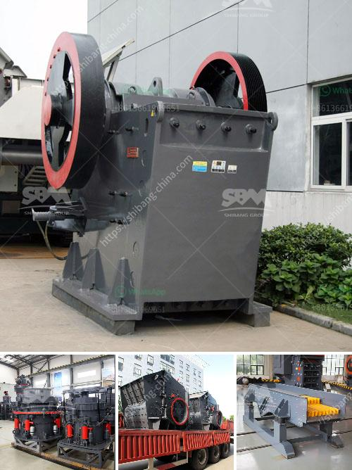

<h3>gravel production line</h3>
Gravel, an integral component in the construction industry, plays a crucial role in laying a solid foundation for various infrastructural projects. The production of gravel requires a well-organized and efficient production line, ensuring a steady supply of this essential material.

A gravel production line is a series of machines working together to crush oversized gravel materials into smaller, more manageable pieces. This ensures that the gravel meets the required specifications for construction projects, such as roads, bridges, and buildings. The production line begins with a jaw crusher, which initially breaks down the larger gravel pieces.

Once the jaw crusher has reduced the gravel to a smaller size, it is then transported to a cone crusher. The cone crusher further breaks down the gravel into even smaller pieces, creating a consistent and uniform product. This crushed gravel is then screened through vibrating screens, which separate the gravel into different sizes. The sorted gravel is then stockpiled for transportation and use.

One of the key advantages of a gravel production line is its ability to produce a large quantity of gravel in a short amount of time. With the increasing demand for construction materials, maintaining a steady supply of gravel is essential. A production line can process a significant amount of crushed gravel, ensuring a continuous supply for construction projects.

Furthermore, a gravel production line allows for customization and flexibility. Different sizes and types of gravel can be produced to meet the specific requirements of different construction projects. This ensures that builders have access to the right kind of materials for their project, improving the quality and longevity of the constructed structures.

In conclusion, a well-designed and efficient gravel production line is essential for meeting the demands of the construction industry. By breaking down oversized gravel into smaller, more manageable sizes, a production line ensures a steady supply of materials necessary for various construction projects. With the ability to produce a large quantity of gravel in a short amount of time and the flexibility to customize sizes and types, a gravel production line provides a solid foundation for construction.
<h3>Contact us</h3><ul><li><strong>Whatsapp:&nbsp;<a href="https://wa.me/8613661969651">+8613661969651</a></strong></li><li><a href="https://swt.shibang-china.com/?git&amp;zhl&amp;gravel production line"><strong>Online Service(chat now)</strong></a></li></ul><h3>Related</h3><ul><li><a href='mobile glass crushing plant.md'>mobile glass crushing plant</a></li><li><a href='gold wash plant at south africa gold mine.md'>gold wash plant at south africa gold mine</a></li><li><a href='market analysis of stone crusher.md'>market analysis of stone crusher</a></li><li><a href='chrome ore mining plant sudan.md'>chrome ore mining plant sudan</a></li><li><a href='aggregate crushing machine.md'>aggregate crushing machine</a></li></ul>