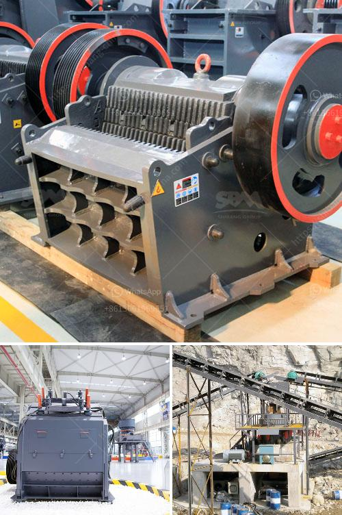

<h3>gravel washing plant</h3>
Construction projects rely heavily on high-quality aggregate materials, such as gravel, to ensure the durability and longevity of structures. These materials play a crucial role in creating a solid foundation for buildings, roads, bridges, and many other infrastructure projects. To obtain clean and well-graded gravel, construction companies utilize gravel washing plants, which serve as essential production facilities. In this article, we will explore the features, benefits, and importance of a gravel washing plant in the construction industry.

A gravel washing plant, also known as a sand and gravel wash plant, enables the washing and sorting of gravel and other materials to remove impurities such as clay and silt. This process not only improves the quality of the gravel but also protects downstream equipment from damage caused by these unwanted materials. The plant typically consists of several components, including a feed hopper, a conveyor system, a rotating screen, and a log washer.

The feed hopper acts as a storage unit for the excavated gravel, ensuring a continuous supply to the subsequent stages. A conveyor system then transports the gravel from the feed hopper to the rotating screen, where it undergoes the first step of classification. This screen separates the gravel into different sizes, ensuring that only the particles within the desired size range proceed further.

After classification, the gravel enters the log washer, which agitates and cleans the material thoroughly. The log washer utilizes the friction generated by rotating logs to remove impurities such as clay and organic matter. It effectively scrubs the gravel, creating clean and well-graded aggregate materials. The cleaned gravel then passes through additional screens to further refine the sizes and eliminate any remaining impurities.

The benefits of a gravel washing plant are numerous. Firstly, it ensures the production of high-quality aggregate, meeting the demanding specifications required for construction projects. By removing impurities, the plant reduces the risk of weak points or structural damage in completed structures. Additionally, clean gravel provides better compaction and improves the overall stability of foundations, enhancing the longevity and safety of constructed structures.

Moreover, a gravel washing plant offers considerable cost savings for construction companies. Producing clean gravel on-site eliminates the need to purchase expensive pre-washed aggregate from external suppliers. This reduction in transportation costs and reliance on external sources can significantly contribute to project budget optimization.

Furthermore, environmental concerns are addressed through the use of gravel washing plants. By removing unwanted materials at the source, the plant minimizes the release of harmful substances into the surrounding environment, such as sediments that can harm aquatic ecosystems. Additionally, the cleaning process reduces dust emissions, ensuring a safer and healthier working environment for construction site personnel.

In conclusion, a gravel washing plant plays a critical role in the construction industry by producing clean and well-graded aggregate materials. Its ability to remove impurities, improve the quality of gravel, and offer cost savings make it an essential production facility for construction companies. By utilizing a gravel washing plant, construction projects can ensure the durability, stability, and safety of structures, while also contributing to environmental sustainability.
<h3>Contact us</h3><ul><li><strong>Whatsapp:&nbsp;<a href="https://wa.me/8613661969651">+8613661969651</a></strong></li><li><a href="https://swt.shibang-china.com/?git&amp;zhl&amp;gravel washing plant"><strong>Online Service(chat now)</strong></a></li></ul><h3>Related</h3><ul><li><a href='slag crusher makers in india.md'>slag crusher makers in india</a></li><li><a href='vibrating screen prices.md'>vibrating screen prices</a></li><li><a href='business plan template for cement plant.md'>business plan template for cement plant</a></li><li><a href='hand stone crushing machines uganda.md'>hand stone crushing machines uganda</a></li><li><a href='estimated budget for a conveyor belt.md'>estimated budget for a conveyor belt</a></li></ul>