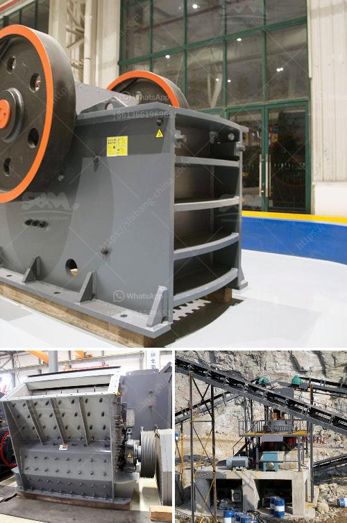

<h3>greatwall jaw crusher</h3>
The Great Wall jaw crusher is widely used in mining, building materials, chemical industry, metallurgy and so on. It is suitable for primary and secondary crushing all kinds of minerals and rocks with compressive strength less than 320 MPa.

The Great Wall jaw crusher is high efficient and energy-saving. It utilizes the latest technology and has a reliable performance. The structure of the machine is simple and it is easy to maintain. It has a large feed opening and a high crushing ratio, which ensures that the materials can be evenly crushed. The adjusting range of the discharge opening is wide, so it can meet the different needs of users.

With the continuous development of mining technology, the Great Wall jaw crusher has also made great progress. The machine is equipped with a hydraulic system, which allows for easy adjustment of the discharge port and quick release of iron. This prevents damage to the crusher caused by non-crushable materials. In addition, the machine has a unique deep V-shaped crushing chamber design, which enhances the capacity of the crusher and improves the crushing efficiency.

Not only is the Great Wall jaw crusher reliable and efficient, but it is also environmentally friendly. The machine produces less noise and dust, which creates a comfortable working environment. Moreover, it has a low energy consumption and does not cause pollution to the surrounding environment.

In conclusion, the Great Wall jaw crusher is an excellent choice for crushing materials. It offers high efficiency, reliability, and environmental friendliness. With its advanced technology and user-friendly design, it is widely used in various industries. Whether it is used for primary or secondary crushing, the Great Wall jaw crusher ensures that the materials are crushed evenly and efficiently.
<h3>Contact us</h3><ul><li><strong>Whatsapp:&nbsp;<a href="https://wa.me/8613661969651">+8613661969651</a></strong></li><li><a href="https://swt.shibang-china.com/?git&amp;zhl&amp;greatwall jaw crusher"><strong>Online Service(chat now)</strong></a></li></ul><h3>Related</h3><ul><li><a href='graphite powder making machine.md'>graphite powder making machine</a></li><li><a href='how to make long lasting talcum powder.md'>how to make long lasting talcum powder</a></li><li><a href='jual stone crusher merk.md'>jual stone crusher merk</a></li><li><a href='quarry crusher plant in ethiopia.md'>quarry crusher plant in ethiopia</a></li><li><a href='harga mesin pemecah batu kapasitas satu ton.md'>harga mesin pemecah batu kapasitas satu ton</a></li></ul>