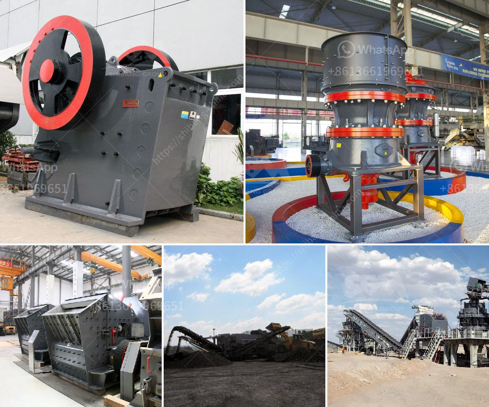

<h3>grinder mill china</h3>
The grinder mill is an indispensable tool in every kitchen, mainly used for grinding spices, nuts, and grains. In recent years, China has emerged as a leading manufacturer of high-quality grinder mills, providing a wide array of options to cater to various culinary needs.

When it comes to grinder mills, China offers a diverse range of products, from manual to electric, making it a desirable choice for consumers worldwide. These mills are crafted using superior-quality materials, ensuring durability and excellent performance. Many of them boast stainless steel blades that are resistant to corrosion, maintaining a sharp edge for an extended period.

One of the primary advantages of buying a grinder mill from China is the innovative features they offer. Some advanced models come with adjustable grinding settings, allowing users to control the coarseness of their ingredients based on their personal preference. This versatility is a major selling point for those who enjoy experimenting with different flavors and textures in their dishes.

Furthermore, grinder mills from China are designed with convenience in mind. Several models include detachable parts that are dishwasher safe, making cleaning an effortless task. Additionally, some grinder mills come with large-capacity grinding chambers, ideal for those who require large quantities of ingredients in a short span of time.

China's grinder mills not only excel in functionality but also in style. With sleek and modern designs, they are an elegant addition to any kitchen countertop. From minimalist to retro aesthetics, there is a wide range of options available, allowing users to find a grinder mill that complements their kitchen decor seamlessly.

In conclusion, if you are in the market for a reliable and efficient grinder mill, consider exploring the offerings from China. With their commitment to excellent craftsmanship, innovative features, and stylish designs, it is no surprise that China has become a go-to destination for those seeking top-quality grinder mills. Whether you are a professional chef or an amateur cook, a grinder mill from China will undoubtedly enhance your culinary experience.
<h3>Contact us</h3><ul><li><strong>Whatsapp:&nbsp;<a href="https://wa.me/8613661969651">+8613661969651</a></strong></li><li><a href="https://swt.shibang-china.com/?git&amp;zhl&amp;grinder mill china"><strong>Online Service(chat now)</strong></a></li></ul><h3>Related</h3><ul><li><a href='complete crusher for sale in ghana.md'>complete crusher for sale in ghana</a></li><li><a href='vibrating screen prices.md'>vibrating screen prices</a></li><li><a href='price crusher machinery price.md'>price crusher machinery price</a></li><li><a href='gold mining equipment stamp mill.md'>gold mining equipment stamp mill</a></li><li><a href='cost of tons per hour crusher plant in india.md'>cost of tons per hour crusher plant in india</a></li></ul>