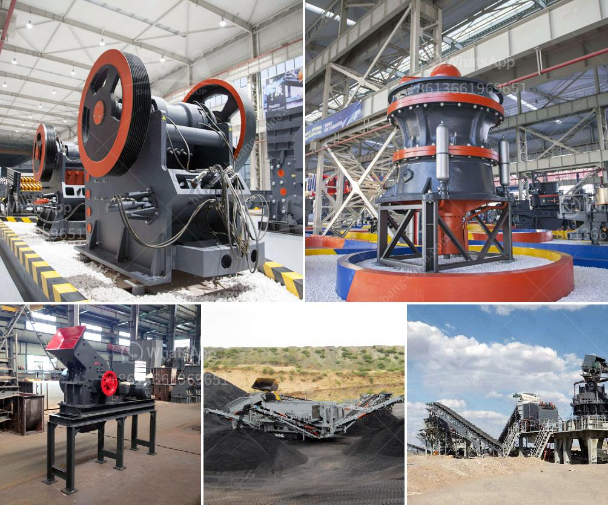

<h3>grinder mill powder singapore</h3>
Singapore, known for its vibrant culture and modern infrastructure, has become a hub for various industries. Among the many industries flourishing in the country, the food and beverage sector holds a significant place. With an array of exotic cuisines and delicacies, Singaporeans have developed a discerning taste for finely ground spices and ingredients. To cater to this demand, grinder mill powder Singapore has emerged as a perfect tool for efficient grinding in kitchens and food processing units.

Grinder mill powder Singapore, also known as grinding mills, are versatile and powerful machines used to grind spices, grains, herbs, and other materials into a fine powder. These mills consist of a grinding mechanism, a motor, and a container or hopper to hold the respective ingredients. The grinding mechanism is usually composed of stainless steel blades or burrs, which ensure precise and efficient grinding.

One of the primary advantages of using a grinder mill powder Singapore is the ability to achieve different levels of fineness. Depending on the recipe's requirements, users can adjust the grinder's settings to obtain coarse or fine powder. This versatility allows cooks and chefs to have complete control over the texture and consistency of their culinary creations.

The grinder mill powder Singapore is not limited to grinding spices and ingredients; it can also be used to grind coffee beans. Singaporeans, known for their love of coffee, can benefit immensely from these versatile machines. By grinding their coffee beans at home, individuals can preserve the freshness and aroma, resulting in a more flavorful cup of coffee.

Furthermore, grinder mill powder Singapore is a valuable tool for businesses involved in food processing. Food manufacturers, restaurants, and cafes can benefit from these machines by grinding large quantities of raw materials efficiently. The consistent quality and texture achieved through proper grinding enhance the overall taste and presentation of the final product.

Additionally, grinder mill powder Singapore promotes sustainability and reduces waste. By grinding ingredients, there is less reliance on pre-packaged and processed goods, resulting in a reduction of single-use plastic packaging. Moreover, raw ingredients can be ground precisely, eliminating any unused portions and minimizing food wastage.

In terms of maintenance, grinder mill powder Singapore requires regular cleaning and routine checks to ensure its efficient functioning. Manufacturers and suppliers provide detailed instructions and guidelines to ensure proper care and maintenance. It is advised to clean the grinding mechanism and container thoroughly after each use, avoiding the accumulation of materials and preventing any adverse effects on future grinds.

As the demand for finely ground spices and ingredients continues to rise in Singapore, grinder mill powder Singapore remains an essential tool in kitchens and food processing units. Its ability to deliver consistent results, control fineness, and enhance flavors make it a prized possession for culinary enthusiasts and professionals alike.

In conclusion, grinder mill powder Singapore is revolutionizing the way ingredients are ground and used in cooking. From achieving the perfect consistency in spices to improving the flavor of a cup of coffee, these machines have become indispensable in the culinary world. As Singapore embraces its gastronomic heritage, grinder mill powder Singapore serves as a trusted companion for those seeking quality and efficiency in every meal.
<h3>Contact us</h3><ul><li><strong>Whatsapp:&nbsp;<a href="https://wa.me/8613661969651">+8613661969651</a></strong></li><li><a href="https://swt.shibang-china.com/?git&amp;zhl&amp;grinder mill powder singapore"><strong>Online Service(chat now)</strong></a></li></ul><h3>Related</h3><ul><li><a href='roller mill suppliers in mexico.md'>roller mill suppliers in mexico</a></li><li><a href='company manufactures the best ball mill.md'>company manufactures the best ball mill</a></li><li><a href='harga grinder mill.md'>harga grinder mill</a></li><li><a href='chromite ore crusher in pakistan.md'>chromite ore crusher in pakistan</a></li><li><a href='ball mill grinder for sale.md'>ball mill grinder for sale</a></li></ul>