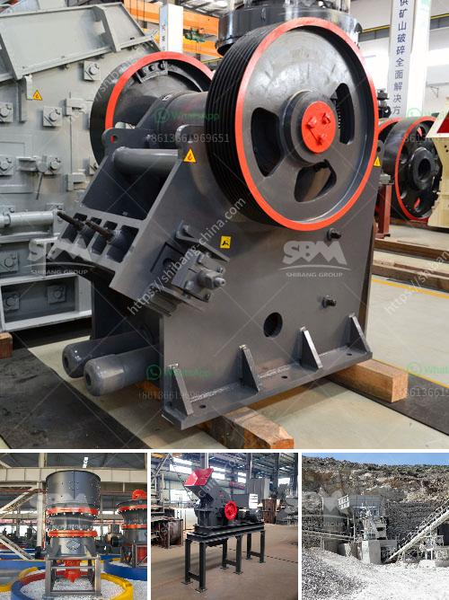

<h3>grinder mill specification</h3>
A grinder mill is a versatile and essential tool used in many industries, including construction, mining, agriculture, and food processing. It is designed to crush and grind various materials into smaller particles, making it easier to handle and process. When choosing a grinder mill, it is crucial to consider its specifications to ensure it meets your specific requirements.

One important specification to consider is the maximum feed size capacity. This refers to the largest size of the material that can be fed into the grinder mill for crushing and grinding. It is important to choose a grinder mill with a maximum feed size capacity that matches your material size requirements. If the feed size exceeds the mill's capacity, it can lead to reduced efficiency and premature wear and tear on the machine.

Another specification to consider is the motor power. The motor power determines the grinding capacity and efficiency of the grinder mill. Higher motor power can handle tougher materials and produce finer grinding results. However, it is essential to balance power consumption and desired results to ensure the grinder mill is energy-efficient and cost-effective.

The speed of the grinder mill is another essential specification. It determines the rate at which the materials are crushed and ground. Higher speeds generally result in finer grinding, but it is necessary to consider the specific material and desired particle size distribution when selecting the appropriate speed. Additionally, some grinder mills allow for adjustable speed settings, providing greater control over the grinding process.

The material of the grinding media is a vital specification. The grinding media, such as balls or rods, come into direct contact with the materials, making it essential to select a material that is appropriate for your specific application. Common materials include steel, ceramic, and high-chrome alloy. Each material offers distinct advantages in terms of durability, efficiency, and cost.

In conclusion, when choosing a grinder mill, it is crucial to consider its specifications to ensure it meets your specific requirements. Factors such as maximum feed size capacity, motor power, speed, and grinding media material should be evaluated to ensure efficient and reliable performance.
<h3>Contact us</h3><ul><li><strong>Whatsapp:&nbsp;<a href="https://wa.me/8613661969651">+8613661969651</a></strong></li><li><a href="https://swt.shibang-china.com/?git&amp;zhl&amp;grinder mill specification"><strong>Online Service(chat now)</strong></a></li></ul><h3>Related</h3><ul><li><a href='types conveyor belts.md'>types conveyor belts</a></li><li><a href='cone crusher in the philippines.md'>cone crusher in the philippines</a></li><li><a href='turkey jaw crusher.md'>turkey jaw crusher</a></li><li><a href='quarry crusher plant in malaysia.md'>quarry crusher plant in malaysia</a></li><li><a href='ball mill specification limestone grinding.md'>ball mill specification limestone grinding</a></li></ul>