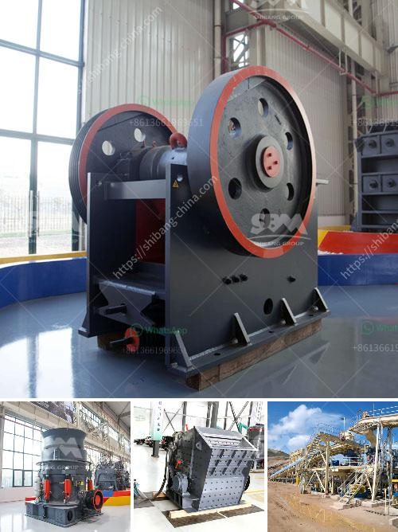

<h3>grinding ball mill machine</h3>
The grinding ball mill machine is a key equipment for regrinding materials after they have been crushed. It is widely used in the mining, building materials, chemical, metallurgy, cement, glass, ceramics and other industries. The machine offers a high grinding efficiency and low energy consumption, thus allowing for the production of fine and ultra-fine particles.

The grinding ball mill machine consists of a rotating cylindrical shell filled with grinding media such as ceramic or metal balls. The material to be ground is added into the shell and as the cylinder rotates, the balls tumble onto the material, crushing and pulverizing it. This action generates friction and impact forces, resulting in the reduction of the particle size.

One of the main advantages of the grinding ball mill machine is its versatility. It can be used for both wet and dry grinding processes and can be equipped with different types of lining materials to suit specific requirements. Additionally, the machine can be customized to accommodate different materials and grinding media sizes.

The grinding ball mill machine is designed to produce very fine particles by reducing the size of the material being processed. This results in improved efficiency of the grinding process and increases the surface area of the material, allowing for better mixing and faster reactions in subsequent steps of the process.

Furthermore, the grinding ball mill machine offers a number of other advantages over conventional mills. It has a simple and compact design, making it easy to install and operate. It also has low maintenance requirements, ensuring minimal downtime and high availability. Additionally, the machine has a high grinding capacity, allowing for large quantities of material to be processed in a short period of time.

In terms of energy consumption, the grinding ball mill machine is highly efficient. It uses less power compared to other types of mills, such as vertical roller mills or rod mills. This makes it a cost-effective solution for industries looking to reduce their energy consumption and operating costs.

Overall, the grinding ball mill machine is an essential tool for the efficient and sustainable processing of materials. Its versatility, high grinding efficiency, and low energy consumption make it a valuable asset for various industries. Whether used for wet or dry grinding, the machine offers reliable performance and consistent particle size reduction. As technology continues to advance, the grinding ball mill machine will likely see further improvements, further enhancing its capabilities and making it an even more indispensable piece of equipment in various industrial applications.
<h3>Contact us</h3><ul><li><strong>Whatsapp:&nbsp;<a href="https://wa.me/8613661969651">+8613661969651</a></strong></li><li><a href="https://swt.shibang-china.com/?git&amp;zhl&amp;grinding ball mill machine"><strong>Online Service(chat now)</strong></a></li></ul><h3>Related</h3><ul><li><a href='calcium carbonate ball mill.md'>calcium carbonate ball mill</a></li><li><a href='china mini rock crusher.md'>china mini rock crusher</a></li><li><a href='lister grinding mill in kenya.md'>lister grinding mill in kenya</a></li><li><a href='calcite powder manufacturer machines.md'>calcite powder manufacturer machines</a></li><li><a href='how many kg in 1 cubic feet of 20mm crusher stone.md'>how many kg in 1 cubic feet of 20mm crusher stone</a></li></ul>