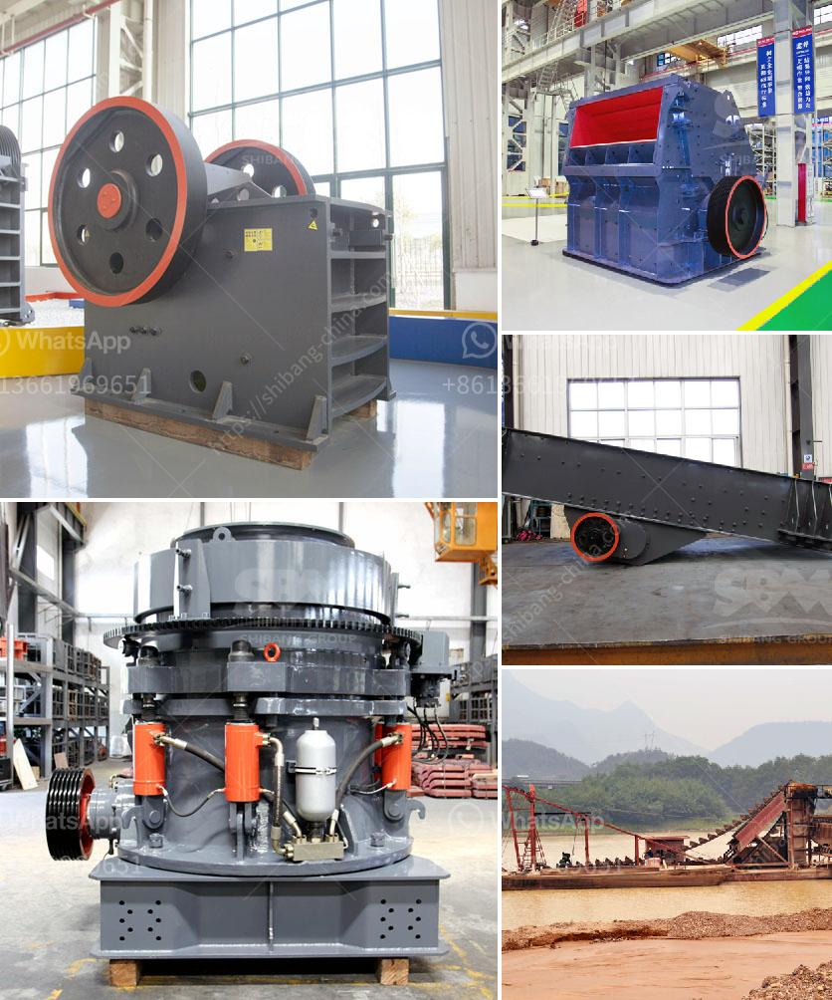

<h3>grinding equipment raymond mill</h3>
Grinding is a common mechanical equipment for ore processing. Raymond mill can be used for grinding more than 280 kinds of materials in mining, metallurgy, chemical, building materials and other industries. With the continuous development of the market economy, the demand for Raymond mill is also increasing. Raymond mill is widely used in non-metallic mineral grinding industry. It has the advantages of stable performance, high efficiency and energy saving, convenient maintenance and low pollution.

Raymond mill is a kind of grinding equipment with a long history. It is widely used in various industries because of its excellent performance. The Raymond mill produced by our company adopts advanced structure of similar products at home and abroad, and is updated and improved on the basis of Raymond mill in the same industry. The equipment has higher efficiency, lower power consumption, smaller floor space and lower investment than traditional Raymond mill.

Raymond mill is mainly composed of host, analyzer, blower, finished product cyclone separator, pipeline device, motor and other components. The main machine is composed of a frame, an inlet volute, a blade, a grinding roller, a grinding ring, a cover and a motor. The auxiliary equipment includes jaw crusher, bucket elevator, electromagnetic vibration feeder and electric control cabinet.

Raymond mill works by grinding the material between the grinding roller and the grinding ring. The grinding roller and the grinding ring rotate at a high speed, and the material is ground by the action of the grinding roller and the grinding ring. The powder after grinding is brought into the analysis machine along with the circulating air of the blower, and the qualified fine powder enters the cyclone powder collector with the airflow for separation and collection. The finished powder is discharged through the powder outlet pipe and is the finished product. The air flow returns to the fan from the upper part of the cyclone collector, and the air path is cyclically flowing, and the whole machine works in a negative pressure state.

Raymond mill has the advantages of small occupation area, large output, low energy consumption and simple operation. It is an ideal grinding equipment for various ores. Compared with other grinding equipment, Raymond mill has the following outstanding advantages:

1. High grinding efficiency: The grinding roller is used to crush the material, and the grinding ring is tightly pressed on the grinding roller. Therefore, when the grinding roller and the grinding ring are worn to a certain thickness, the yield and fineness of the finished product can be ensured.

2. Stable performance: The transmission device of Raymond mill adopts sealed gearbox and belt wheel, which ensures the smooth transmission and reliable operation of the whole machine.

3. Energy saving: The electrical system adopts centralized control, and the grinding workshop can realize unmanned operation. The energy consumption is reduced by more than 30% compared with the traditional grinding equipment.

4. Low pollution: The whole machine has a sealed structure and works under negative pressure, which effectively avoids dust pollution.

In conclusion, Raymond mill is a widely used grinding equipment with high efficiency, energy saving, small occupation area and low pollution. With the continuous development of the market economy, the demand for Raymond mill is also increasing. As a professional manufacturer of grinding equipment, our company provides customers with customized services. We can design the corresponding production line according to the actual needs of customers to maximize their benefits.
<h3>Contact us</h3><ul><li><strong>Whatsapp:&nbsp;<a href="https://wa.me/8613661969651">+8613661969651</a></strong></li><li><a href="https://swt.shibang-china.com/?git&amp;zhl&amp;grinding equipment raymond mill"><strong>Online Service(chat now)</strong></a></li></ul><h3>Related</h3><ul><li><a href='used vibro screener for sale.md'>used vibro screener for sale</a></li><li><a href='concrete recycling crushing plant crusher for sale.md'>concrete recycling crushing plant crusher for sale</a></li><li><a href='sell crusher conica peru.md'>sell crusher conica peru</a></li><li><a href='combined gold and diamond wash plants.md'>combined gold and diamond wash plants</a></li><li><a href='kaolin manufacturing process.md'>kaolin manufacturing process</a></li></ul>