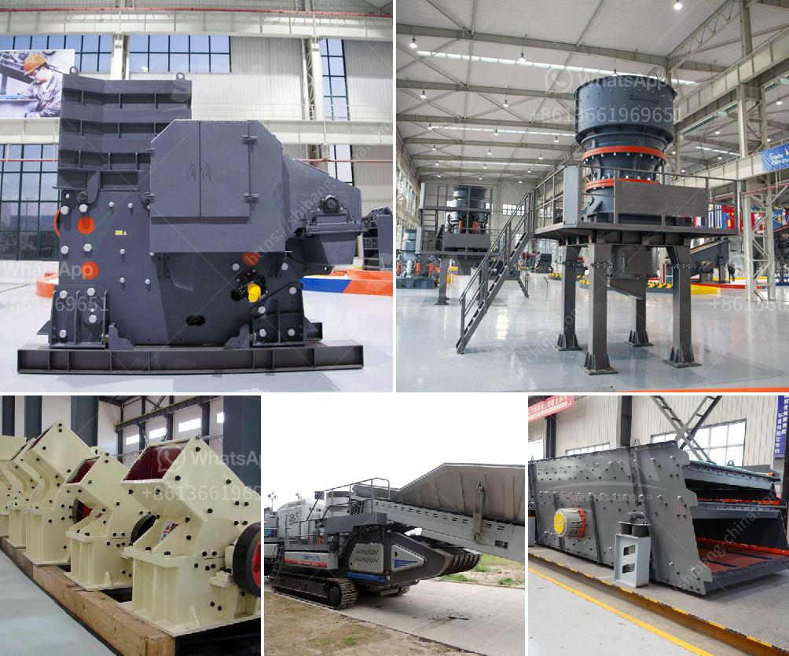

<h3>grinding machine for white clay in india</h3>
Grinding machines have been widely used in the construction industry for efficient and fast grinding of different materials such as cement, limestone, coal, iron ore, and white clay. White clay is one of the key raw materials used in the manufacturing of ceramic products. As such, grinding machines for white clay in India play an important role in the ceramic manufacturing industry.

White clay is finely grained and relatively soft, making it a highly versatile material that can be used in various applications. It is commonly used to produce ceramics, tableware, sanitary ware, bricks, tiles, and many other products. To transform the raw white clay into a fine powder, it is essential to utilize grinding machines that can achieve the desired particle size.

In India, manufacturers are increasingly adopting advanced grinding machines to meet the growing demand for high-quality white clay products. These machines not only help improve productivity and efficiency but also ensure consistency in the particle size distribution of the final product. The use of grinding machines has become indispensable in ensuring the desired quality and properties of white clay materials.

One commonly used grinding machine is the ball mill. The ball mill is a horizontal cylindrical container that rotates around its axis, driven by a motor. Inside the cylinder, ceramic balls are used for grinding white clay materials. The solid particles in the raw materials are ground and mixed with water in the ball mill to form a slurry. The slurry is then pumped into a storage tank for further processing or transferred directly to the ceramic manufacturing process.

A key advantage of using ball mills for grinding white clay materials is their ability to grind and homogenize the raw materials efficiently. The rotating motion of the cylindrical container ensures that the grinding balls constantly collide with and grind the white clay particles, resulting in a fine powder. The grinding process can be controlled by adjusting the rotating speed, time, and the ratio of grinding balls to raw materials, allowing manufacturers to achieve the desired particle size distribution.

Another type of grinding machine used for white clay in India is the Raymond mill. This mill is designed to grind fine powders with a maximum particle size of 325 mesh (44 microns). The mill chamber is equipped with grinding rollers that apply a high-pressure force, which can grind the white clay particles to a finer size. The grinding process is continuous, and the final product can be collected through a cyclone separator or dust collector system.

In conclusion, grinding machines for white clay in India are critical for the ceramic manufacturing industry. These machines help transform raw white clay into a fine powder, ensuring the desired particle size distribution for various applications. The use of advanced grinding machines, such as ball mills and Raymond mills, improves productivity, efficiency, and quality in the production of white clay products. With the growing demand for high-quality ceramics in India, manufacturers are increasingly investing in modern grinding machines to stay competitive in the market.
<h3>Contact us</h3><ul><li><strong>Whatsapp:&nbsp;<a href="https://wa.me/8613661969651">+8613661969651</a></strong></li><li><a href="https://swt.shibang-china.com/?git&amp;zhl&amp;grinding machine for white clay in india"><strong>Online Service(chat now)</strong></a></li></ul><h3>Related</h3><ul><li><a href='porur raymond grinding mill.md'>porur raymond grinding mill</a></li><li><a href='stone crusher price in south africa.md'>stone crusher price in south africa</a></li><li><a href='how to start a stone crushing business in nigeria.md'>how to start a stone crushing business in nigeria</a></li><li><a href='aggregate washing plant saudi arabia.md'>aggregate washing plant saudi arabia</a></li><li><a href='material using for making talcum powder.md'>material using for making talcum powder</a></li></ul>