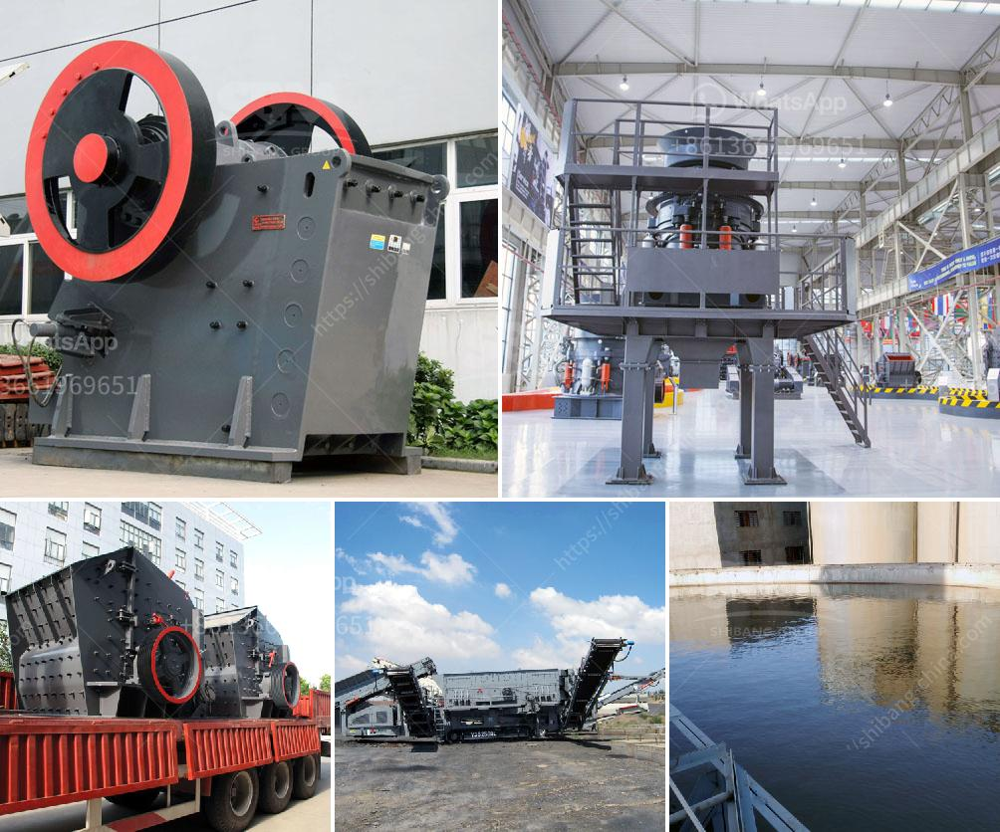

<h3>grinding machine philippines</h3>
A grinding machine is used to shape and finish a given material with low surface roughness and high surface quality. It is primarily a finishing operation that removes relatively small quantities of metal, to deliver highly accurate products. However, certain grinding applications also involve swiftly eliminating high volumes of metal. It comprises of a wide range of materials, which can be either synthetic or natural. Grinding machines are made of materials such as iron, steel, aluminum, brass, bronze, copper, nickel, wood, ceramics, plastics, rubber, and other materials.

In the Philippines, there is a high demand for grinding machines, as local businesses and DIY enthusiasts have realized the tremendous advantages of this power tool. They have become an essential tool for various industries and households, providing immense assistance to reduce workload and enhance productivity.

One common application of grinding machines in the Philippines is the finishing of metals and other materials. They are frequently used to give a refined and glossy surface finish to metallic objects such as automobiles, bikes, jewelry, and appliances. Grinding machines are also utilized by fabricators in the Philippines to remove burrs and sharp edges from metal sheets, pipes, and plates. This ensures the safety of workers as they handle these materials during the manufacturing process.

Moreover, grinding machines in the Philippines cater to the demands of construction workers, as they perform grinding and polishing tasks for both stone and concrete surfaces. They are also used to repair damaged surfaces and provide a smooth and even finish, making them indispensable tools for construction projects.

In addition to hard materials, grinding machines in the Philippines can also be used for various soft materials. For instance, they are employed to grind corn, rice, and other grains, resulting in fine powder for food products and ingredients. Food processing companies and even households rely on grinding machines to produce flour, pastes, and other food items.

The versatility of grinding machines in the Philippines goes beyond material finishing and food processing. They are also used for precision applications, such as sharpening blades and cutting tools. DIY enthusiasts greatly benefit from grinding machines as they can sharpen their own knives, scissors, chisels, and other bladed tools. This eliminates the need to outsource sharpening tasks, resulting in cost savings in the long run.

With a wide range of options available in the market, Filipino consumers can choose from different types of grinding machines, such as angle grinders, bench grinders, cylindrical grinders, and surface grinders. Each machine has its own specific features and advantages, allowing users to select the most suitable one for their intended applications.

In conclusion, grinding machines in the Philippines are versatile power tools that have gained popularity and indispensability in various industries and households. They offer a wide array of applications, from surface finishing and food processing to precision sharpening. As the demand for grinding machines continues to rise, manufacturers have also improved and expanded their product offerings, ensuring that there is always an ideal machine available for any specific grinding requirement.
<h3>Contact us</h3><ul><li><strong>Whatsapp:&nbsp;<a href="https://wa.me/8613661969651">+8613661969651</a></strong></li><li><a href="https://swt.shibang-china.com/?git&amp;zhl&amp;grinding machine philippines"><strong>Online Service(chat now)</strong></a></li></ul><h3>Related</h3><ul><li><a href='complete scm stone crushing plant 4tph.md'>complete scm stone crushing plant 4tph</a></li><li><a href='companies manufacturing quarry plant in uk.md'>companies manufacturing quarry plant in uk</a></li><li><a href='how to decrease the dust in a crushing plant.md'>how to decrease the dust in a crushing plant</a></li><li><a href='coal crusher buyer in philippines.md'>coal crusher buyer in philippines</a></li><li><a href='gold mining crusher machinery.md'>gold mining crusher machinery</a></li></ul>