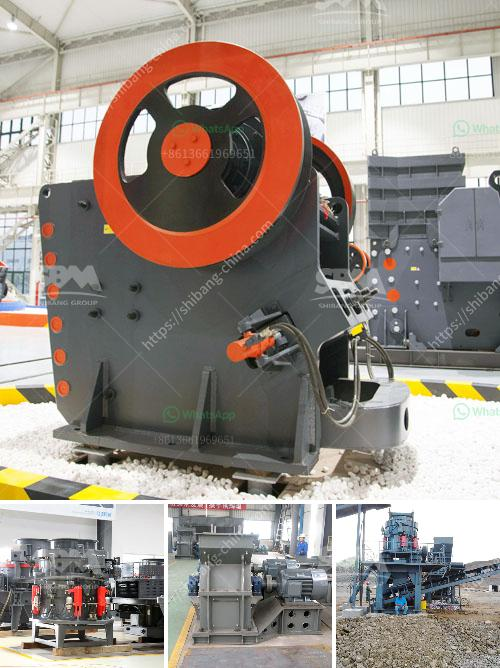

<h3>grinding machine project report</h3>
Grinding machines are tools used in the development of products with critical dimensions. They use an abrasive wheel as the tool for grinding. There are several types of grinding machines such as surface grinders, bench grinders, cylindrical grinders, tool and cutter grinders, jig grinders, gear grinders, profile grinders, and special purpose grinders. These machines are widely used in automobile manufacturing, power plants, construction, fabrication, electrical, and various other industries.

A grinding machine project report is a document that summarizes the relevant details of the grinding machine project. It covers the project's objective, the project scope, the project's timeframe, and the expected deliverables. It also includes a list of key stakeholders involved in the project and their roles and responsibilities. The report provides an overview of the project's budget, including any cost overruns or savings. It also highlights any risks and issues that may arise during the project and presents mitigation strategies to address them.

This article aims to present a brief overview of a grinding machine project report. The report includes comprehensive information about the project, including the machine's specifications and design, manufacturing process, testing procedures, and performance evaluation. It also includes information about the project's financials, including the investment and expected return on investment.

The report provides a detailed analysis of the project's implementation, including the challenges faced and the lessons learned. It also highlights any improvements made during the course of the project. Additionally, the report presents recommendations for future projects or enhancements to the current one.

In conclusion, a grinding machine project report is an essential document that provides a comprehensive overview of the project. It helps stakeholders understand the project's objectives, scope, and key deliverables. The report also presents an analysis of the project's implementation and offers recommendations for future projects.
<h3>Contact us</h3><ul><li><strong>Whatsapp:&nbsp;<a href="https://wa.me/8613661969651">+8613661969651</a></strong></li><li><a href="https://swt.shibang-china.com/?git&amp;zhl&amp;grinding machine project report"><strong>Online Service(chat now)</strong></a></li></ul><h3>Related</h3><ul><li><a href='crushing of concrete in pakistan.md'>crushing of concrete in pakistan</a></li><li><a href='crusher machine in uae.md'>crusher machine in uae</a></li><li><a href='limestone stone making plant.md'>limestone stone making plant</a></li><li><a href='production process of cement.md'>production process of cement</a></li><li><a href='jaw crusher usa pakistan.md'>jaw crusher usa pakistan</a></li></ul>