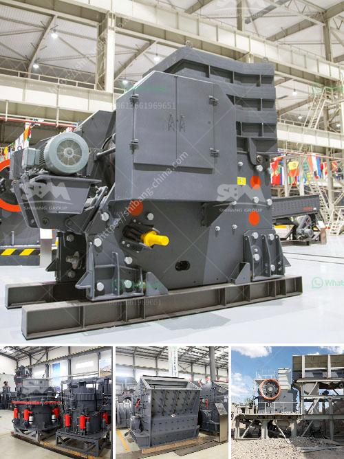

<h3>grinding media for ball mill</h3>
Grinding media for ball mills play a vital role in comminution and ore grinding. They are designed to reduce the size of raw materials, facilitate the grinding process, and ensure efficient operation. This article will discuss some of the most commonly used grinding media in ball mills.

The grinding media in a ball mill is typically steel or ceramic balls of varying sizes, depending on the feed size, work index of the ore, and the size reduction and distribution required in the final product. In mining applications, grinding media are used to reduce the ore size and facilitate the liberation of valuable minerals for subsequent separation processes.

Steel balls are the most commonly used grinding media due to their high hardness, wear resistance, and impact resistance. They are available in various diameters ranging from small balls (typically 10mm) to large balls (up to 125mm) and are made from alloyed or low carbon steels. Steel balls are durable and can withstand the rigorous grinding conditions present in ball mills.

Ceramic balls offer several advantages over steel balls. They have a higher density, which enhances grinding efficiency, and they are non-reactive and non-magnetic, making them suitable for specialized grinding applications. Ceramic balls are typically made from high-purity alumina or zirconia. They are more expensive than steel balls but are particularly well-suited for grinding abrasive or hard materials.

In addition to steel and ceramic balls, other types of grinding media are occasionally used in ball mills. These include cylpebs, which are slightly tapered cylindrical grinding media with rounded edges, and pebbles, which are used exclusively in autogenous grinding mills.

Choosing the right grinding media for ball mills is crucial to ensure optimal grinding performance and minimize wear and tear on the mill. Factors to consider when selecting grinding media include the type of mill, desired product size, media density, abrasiveness of the ore, and the desired grinding mechanism.

In conclusion, grinding media for ball mills are essential for effective comminution and ore grinding. Steel balls and ceramic balls are commonly used due to their durability and suitability for various applications. The selection of grinding media should be based on the specific requirements of the milling process to achieve the desired grinding performance.
<h3>Contact us</h3><ul><li><strong>Whatsapp:&nbsp;<a href="https://wa.me/8613661969651">+8613661969651</a></strong></li><li><a href="https://swt.shibang-china.com/?git&amp;zhl&amp;grinding media for ball mill"><strong>Online Service(chat now)</strong></a></li></ul><h3>Related</h3><ul><li><a href='used screens crushers for coal uk.md'>used screens crushers for coal uk</a></li><li><a href='river pebble crusher supplier.md'>river pebble crusher supplier</a></li><li><a href='crusher machine saudi arabia.md'>crusher machine saudi arabia</a></li><li><a href='stone dust making machine.md'>stone dust making machine</a></li><li><a href='harga stone crusher 250 ton jam indonesia.md'>harga stone crusher 250 ton jam indonesia</a></li></ul>