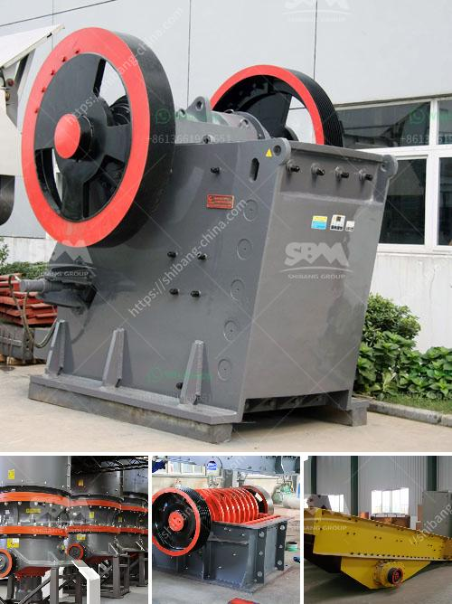

<h3>grinding mill machine cost price south africa</h3>
As the world’s leading manufacturer of crushing, grinding, and mining equipment, we provide advanced and reasonable solutions for any size reduction requirements, including quarry, aggregate, grinding production, and complete stone crushing plant. We have analyzed the problems encountered by customers in South Africa when looking for grinding mill machines and summarized some tips for you.

Firstly, the quality and performance of grinding mills have a great impact on the cost price. Therefore, when choosing a grinding mill machine, we must pay attention to its quality and performance. A high-quality grinding mill can meet the production needs of different industries and bring higher profits. 

Secondly, the amount of production required by customers is another crucial factor to consider. Different grinding mills have different production capacities. When considering the cost, it is necessary to determine the suitable production capacity according to your specific needs. This ensures that you choose a grinding mill machine that can meet your production requirements without overspending.

Thirdly, the types of materials being processed and the hardness of these materials also affect the cost price. Different materials have different requirements for grinding mills. A hard material requires a grinding mill with a higher grinding force, which may result in higher costs. It is important to choose a grinding mill that can effectively process the materials you need without causing unnecessary extra expenses.

In addition, the manufacturer of the grinding mill machine also influences its cost price. Well-established and reputable manufacturers often have higher prices due to their reliable quality and excellent after-sales service. However, the investment is usually worth it as these manufacturers offer better equipment performance, longer service life, and more reliable and efficient maintenance.

Moreover, the maintenance and repair costs of grinding mill machines should be considered. Grinding mill machines need regular maintenance to ensure their performance and prolong their service life. It is recommended to choose a manufacturer that provides timely and professional after-sales service. This will not only reduce maintenance costs but also minimize downtime and improve production efficiency.

Finally, market competition is another aspect to consider when looking at grinding mill machine cost prices in South Africa. Prices may vary among different suppliers due to the different production costs, branding strategies, market conditions, and other factors. Therefore, it is important to compare prices from multiple sources and choose the most cost-effective option. However, it is equally important to avoid compromising on quality in pursuit of lower prices.

In conclusion, when considering grinding mill machine cost prices in South Africa, factors such as quality, production capacity, material requirements, manufacturer reputation, maintenance costs, and market competition should all be carefully taken into account. By doing so, you can find a grinding mill machine that meets your specific needs, maximizes productivity, and offers the best value for your investment.
<h3>Contact us</h3><ul><li><strong>Whatsapp:&nbsp;<a href="https://wa.me/8613661969651">+8613661969651</a></strong></li><li><a href="https://swt.shibang-china.com/?git&amp;zhl&amp;grinding mill machine cost price south africa"><strong>Online Service(chat now)</strong></a></li></ul><h3>Related</h3><ul><li><a href='track mounted mobile crusher plant.md'>track mounted mobile crusher plant</a></li><li><a href='cercetare ball mill in rimania.md'>cercetare ball mill in rimania</a></li><li><a href='raymond mills india.md'>raymond mills india</a></li><li><a href='mill grinding plants balls.md'>mill grinding plants balls</a></li><li><a href='jaw crusher equipment supplier.md'>jaw crusher equipment supplier</a></li></ul>