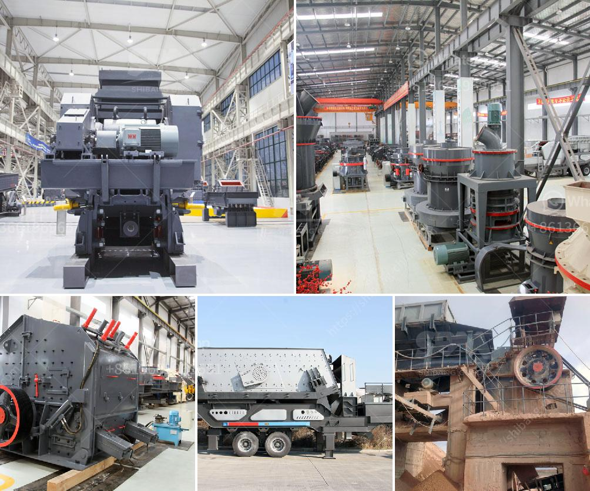

<h3>grinding mill machine price</h3>
When it comes to purchasing a grinding mill machine, price is undoubtedly one of the most important factors to consider. In today's competitive market, finding an affordable grinding mill machine can be a daunting task. However, understanding the various factors that influence the price can help you make an informed decision.

Grinding mill machines are widely used in various industries, including mining, construction, chemical, metallurgy, and more. These machines are designed to grind different materials into fine particles or powders, which are essential raw materials in many production processes.

The first and foremost factor that influences the price of a grinding mill machine is the brand. Well-known brands tend to have higher price tags due to their reputation and the quality they offer. These brands invest heavily in research and development to ensure their machines are efficient, durable, and reliable. Although they may cost more upfront, opting for a reputable brand usually pays off in the long run, as you can rest assured that you are purchasing a high-quality product that will last.

The second factor that affects the price is the type of grinding mill machine. There are several types available on the market, including ball mills, rod mills, hammer mills, and vertical mills, each designed for different grinding tasks. Depending on your specific requirements, you may need to invest in a specific type of machine, which can impact the price.

The third factor to consider is the machine's size and production capacity. Grinding mill machines vary in size, from compact units suitable for small-scale applications to large-scale machines capable of handling massive quantities of materials. Generally, larger machines with higher production capacities command higher prices, as they are designed to handle more significant tasks and offer increased productivity.

Additionally, the materials used in the construction of the machine play a crucial role in determining its price. Grinding mill machines are typically made of heavy-duty materials that can withstand the harsh grinding process and ensure long-lasting performance. However, different materials have varying costs, which can affect the final price.

Lastly, factors such as warranty, after-sales service, and additional features can also influence the price. Some manufacturers offer extended warranties, which provide peace of mind and assurance against manufacturing defects. Furthermore, after-sales service, including technical support, spare parts availability, and maintenance services, can add value to the machine and justify a higher price.

Considering all these factors, the price of a grinding mill machine can range from a few thousand dollars to several hundred thousand dollars. It is crucial to assess your specific needs, budget, and long-term requirements before making a purchase decision. Comparing prices from different manufacturers and evaluating the value they offer in terms of quality, performance, and after-sales support is essential.

In conclusion, the price of a grinding mill machine is influenced by various factors, including brand reputation, type of machine, size, production capacity, materials used, warranty, and additional features. Balancing these factors with your specific requirements will help you find a grinding mill machine that meets your needs while staying within your budget. Remember, investing in a high-quality machine may cost more initially, but it often proves to be a wise investment in the long run.
<h3>Contact us</h3><ul><li><strong>Whatsapp:&nbsp;<a href="https://wa.me/8613661969651">+8613661969651</a></strong></li><li><a href="https://swt.shibang-china.com/?git&amp;zhl&amp;grinding mill machine price"><strong>Online Service(chat now)</strong></a></li></ul><h3>Related</h3><ul><li><a href='300 tph jaw crusher.md'>300 tph jaw crusher</a></li><li><a href='limestone grinding mill german for sale.md'>limestone grinding mill german for sale</a></li><li><a href='granite quarry plants for sale.md'>granite quarry plants for sale</a></li><li><a href='price of stone crusher in philippines.md'>price of stone crusher in philippines</a></li><li><a href='how to improve grinding efficiency of a mill.md'>how to improve grinding efficiency of a mill</a></li></ul>