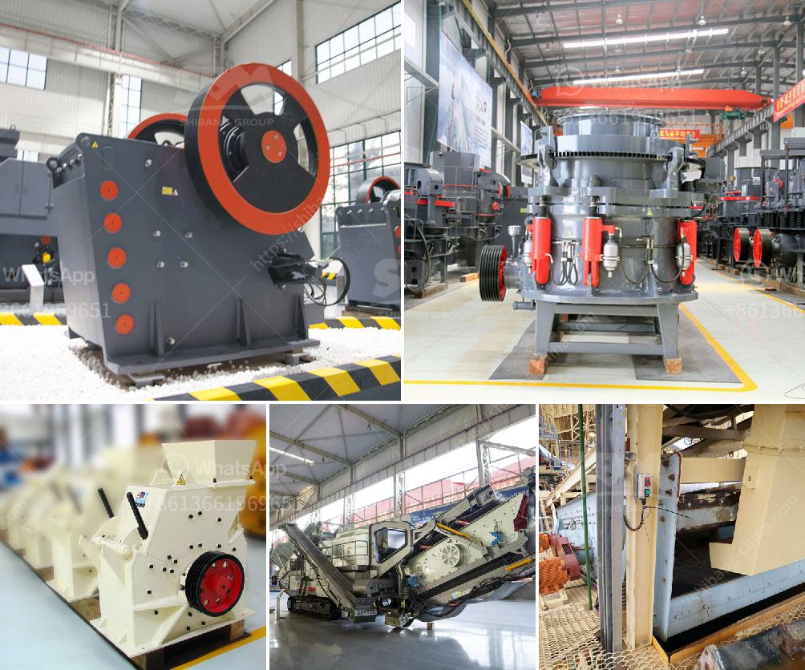

<h3>grinding mill made in germany</h3>
Germany is widely recognized as the country where the industrial revolution began in the late 18th century. Ever since then, German engineering has been on the forefront of technological innovation, making the nation renowned for its exceptional craftsmanship and precision. One particular industry that showcases this excellence is the manufacturing of grinding mills.

Grinding mills are machines used for pulverizing solid materials into fine powders or suspensions (called slurries), which are widely utilized in various industries including mining, construction, pharmaceuticals, and more. German grinding mills are highly sought after due to their high quality, efficiency, and reliability.

Historically, German grinding mills were powered by windmills, waterwheels, or animals. As technology evolved, steam power became the driving force behind these mills. In the early 19th century, the steam engine was introduced to the industrial world, revolutionizing the production process. This innovation allowed for greater control over the milling process, increased production rates, and improved product consistency.

German grinding mills made during this era were characterized by their solid construction and heavy-duty design, which ensured durability and longevity. These mills were built to withstand the demanding conditions of industrial operations, allowing them to perform efficiently for extended periods without compromising their performance.

In the 20th century, German engineers continued to push the boundaries of grinding mill technology, constantly seeking new ways to improve efficiency and productivity. This led to the development of advanced machines, incorporating features such as automatic feeding systems, adjustable grinding parameters, and precise temperature control.

Today, German grinding mills are equipped with state-of-the-art technology, making them highly efficient and versatile. These mills have the ability to finely grind a wide range of materials, from minerals and ores to food ingredients and chemicals. Furthermore, they can produce customized particle sizes, ensuring optimal results for various industrial applications.

The reputation of German grinding mills extends far beyond their borders. Companies from around the world seek out these mills, recognizing their exceptional quality and reliability. German engineering expertise, coupled with rigorous quality control measures, ensures that each mill meets the highest standards.

German grinding mills not only provide excellent performance but also prioritize sustainability. Many mills are designed with energy-efficient features, minimizing their environmental impact. Additionally, their robust construction and long lifespan contribute to reducing waste and promoting sustainability.

In conclusion, German grinding mills have a long and impressive history of excellence. From the early days of windmills and waterwheels to the introduction of steam power, German engineers have been at the forefront of grinding mill innovation. Today, these mills are equipped with cutting-edge technology, ensuring high performance, efficiency, and sustainability. Whether used in mining, construction, or pharmaceutical industries, German grinding mills continue to be highly sought after worldwide.
<h3>Contact us</h3><ul><li><strong>Whatsapp:&nbsp;<a href="https://wa.me/8613661969651">+8613661969651</a></strong></li><li><a href="https://swt.shibang-china.com/?git&amp;zhl&amp;grinding mill made in germany"><strong>Online Service(chat now)</strong></a></li></ul><h3>Related</h3><ul><li><a href='vertical mill of a cement company.md'>vertical mill of a cement company</a></li><li><a href='24 36 jaw crusher for sale usa.md'>24 36 jaw crusher for sale usa</a></li><li><a href='gypsum board manufacturing plant cost india.md'>gypsum board manufacturing plant cost india</a></li><li><a href='barite powder production process.md'>barite powder production process</a></li><li><a href='iron ore crushing equipment in mexico.md'>iron ore crushing equipment in mexico</a></li></ul>