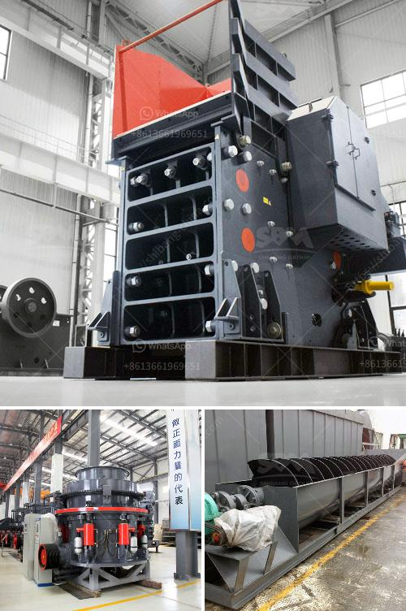

<h3>grinding mill material</h3>
Grinding mills are devices that are used to break down solid materials into smaller pieces by grinding, crushing, or cutting. They are used in various industries to reduce the size of different materials such as minerals, clays, and pigments. The process of grinding involves the material being fed into the mill and then being crushed or ground by the rotating blades of the machine.

One key aspect of grinding mills is the material they are made of. The choice of material plays a crucial role in determining the efficiency, reliability, and durability of the mill. Several factors need to be considered when selecting the right material for grinding mills.

Firstly, the material needs to have high strength and hardness to withstand the tremendous forces and pressures involved in the crushing and grinding process. As the material is being crushed or ground, it exerts significant forces on the mill components. Therefore, the material should have high resistance to wear, abrasion, and deformation to maintain its performance and longevity.

Secondly, the material should have excellent heat resistance to withstand the high temperatures generated during the grinding process. The friction and impact between the grinding media and the material can generate substantial heat. If the material used in the mill is unable to withstand these temperatures, it may lead to a decrease in the efficiency and performance of the mill.

Another crucial factor to consider is the corrosion resistance of the material. Grinding mills are often used in wet or corrosive environments, such as in the mining industry where water is used during the grinding process. The material should be able to resist corrosion caused by water, chemicals, or other corrosive agents to maintain its structural integrity and prevent contamination of the ground material.

Furthermore, the material should have excellent machinability and formability to facilitate the manufacturing process of the grinding mill. It should be easy to shape, cut, and weld to create the necessary components and ensure a precise fit. High machinability allows for efficient production and reduces the time and cost involved in manufacturing the mill.

In conclusion, the material used in grinding mills plays a critical role in determining their performance, efficiency, and durability. The material needs to possess high strength, hardness, heat resistance, and corrosion resistance to withstand the extreme forces, temperatures, and corrosive environments involved in the grinding process. Additionally, it should have excellent machinability to facilitate the manufacturing process. By carefully selecting the right material for grinding mills, industries can ensure that their equipment operates efficiently, reliably, and for a longer period, resulting in improved productivity and reduced downtime.
<h3>Contact us</h3><ul><li><strong>Whatsapp:&nbsp;<a href="https://wa.me/8613661969651">+8613661969651</a></strong></li><li><a href="https://swt.shibang-china.com/?git&amp;zhl&amp;grinding mill material"><strong>Online Service(chat now)</strong></a></li></ul><h3>Related</h3><ul><li><a href='mobile recycle crushing.md'>mobile recycle crushing</a></li><li><a href='marble crushing machinery.md'>marble crushing machinery</a></li><li><a href='24 36 jaw crusher for sale usa.md'>24 36 jaw crusher for sale usa</a></li><li><a href='stone hammer mill machine.md'>stone hammer mill machine</a></li><li><a href='crushers in malaysia.md'>crushers in malaysia</a></li></ul>