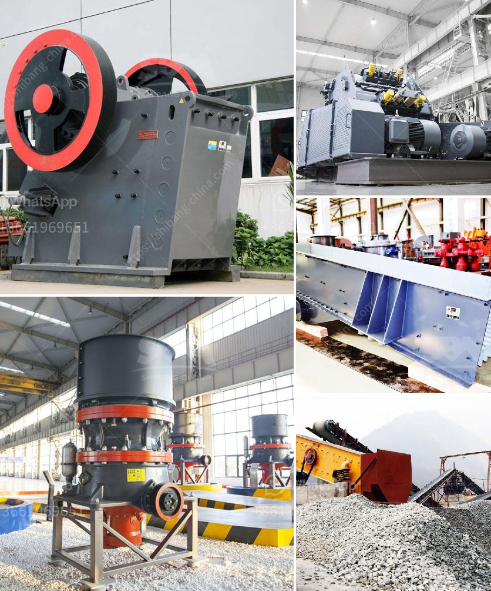

<h3>grinding mill power</h3>
Grinding mills are devices used in many industrial applications to grind various materials into smaller particles with different size distributions. These machines play a crucial role in many processes, such as mining, agriculture, food processing, and construction.

One of the key aspects of grinding mills is their power consumption, as it directly affects the efficiency of the grinding process. Understanding the factors that influence the power consumption of a grinding mill is essential for optimizing its performance and reducing operational costs.

1. Mill Geometry: The size and shape of the mill play a crucial role in determining its power consumption. Larger mills with larger diameter and length have higher power requirements compared to smaller mills. Additionally, the internal design of the mill, including the number and type of grinding media, impacts the power consumption. More efficient designs, such as high-density grinding media and optimized lifter configurations, can significantly reduce power consumption.

2. Ore Characteristics: The properties of the material being ground, such as hardness, abrasiveness, and moisture content, can greatly affect the power consumption of a grinding mill. Harder and more abrasive ores require higher energy input to break them down, leading to increased power consumption. Similarly, wet or sticky materials tend to adhere to the grinding media, resulting in higher power requirements.

3. Feed Size: The size of the feed material entering the mill affects the power consumption. Coarser feed materials require less energy to break them down, leading to lower power consumption. On the other hand, fine particles require more energy to be ground, increasing the power requirements. Optimizing the feed size distribution can help reduce power consumption by ensuring that the energy is efficiently utilized.

4. Grinding Circuit Configuration: The overall grinding circuit configuration can impact the power requirements of a mill. For example, a closed-circuit grinding circuit with high recirculating loads can result in excessive power consumption. By optimizing the circuit configuration, such as adjusting the classification efficiency or reducing the recirculating load, it is possible to reduce the power requirements.

5. Operating Conditions: The operational parameters, such as mill speed, feed rate, and slurry density, also influence the power consumption of a grinding mill. Higher mill speeds and feed rates generally increase power requirements. Additionally, excessive slurry density can lead to excessive power consumption due to increased grinding media wear.

In conclusion, understanding the factors that influence grinding mill power is crucial for optimizing the grinding process and reducing operational costs. Factors such as mill geometry, ore characteristics, feed size, grinding circuit configuration, and operating conditions all contribute to the power requirements. By optimizing each of these factors, it is possible to achieve higher grinding efficiency while minimizing energy consumption. Ensuring the power consumption is optimized not only enhances the grinding process but also contributes to sustainable and environmentally friendly operations.
<h3>Contact us</h3><ul><li><strong>Whatsapp:&nbsp;<a href="https://wa.me/8613661969651">+8613661969651</a></strong></li><li><a href="https://swt.shibang-china.com/?git&amp;zhl&amp;grinding mill power"><strong>Online Service(chat now)</strong></a></li></ul><h3>Related</h3><ul><li><a href='crushers manufacturers in south africa.md'>crushers manufacturers in south africa</a></li><li><a href='mill ball grinding ball mills.md'>mill ball grinding ball mills</a></li><li><a href='steel rolling mill plant suppliers.md'>steel rolling mill plant suppliers</a></li><li><a href='use of talc in fertilizer coating process.md'>use of talc in fertilizer coating process</a></li><li><a href='company that sells vibratory sieves in spain.md'>company that sells vibratory sieves in spain</a></li></ul>