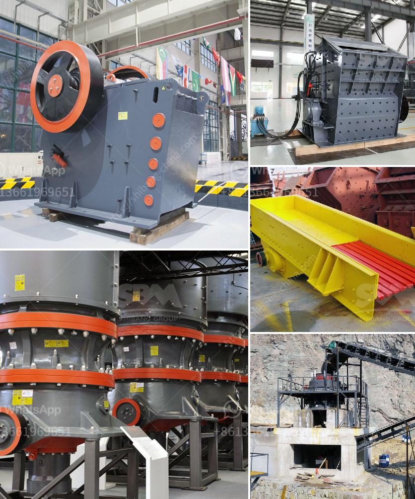

<h3>grinding mill tecator cyclotec</h3>
The grinding mill Tecator Cyclotec is a technologically advanced and versatile grinding device capable of producing a wide range of particle sizes. It utilizes the principles of impact and friction to achieve a homogeneous and fine sample preparation. With its compact design and user-friendly features, it has become a popular choice among researchers and analysts in various fields.

One of the key features of the Tecator Cyclotec is its powerful motor, which ensures efficient grinding even for hard and tough materials. The mill's high-speed rotation delivers consistent results and reduces the need for regrinding, saving both time and energy. This makes it ideal for laboratories and industrial settings where productivity is essential.

The Cyclotec also offers a wide range of applications. It can be used for grinding dry, moist, and oily samples, making it suitable for various types of materials, including grains, seeds, feeds, and spices. The mill's adjustable grinding time feature allows users to customize the grinding process according to their specific needs, ensuring optimal results every time.

In addition to its versatility, the Tecator Cyclotec also offers precise and reliable results. Its special design prevents sample contamination, ensuring accurate analysis. The mill's sturdy construction and durable materials enhance its longevity, making it a reliable investment for long-term usage.

Ease of use is another important feature of the Tecator Cyclotec. It comes with a user-friendly interface that allows for easy operation and monitoring. The transparent lid provides visibility during the grinding process, enabling users to observe the sample's progress. Its compact size and ergonomically designed handle make it easily portable and convenient to use in various locations.

The Tecator Cyclotec also prioritizes safety. It is equipped with safety interlocks and overload protection, ensuring the user's safety during operation. The mill's quiet operation and low vibration levels reduce the risk of accidents and make it suitable for use in spaces where minimal disruption is desired.

In conclusion, the Tecator Cyclotec is a state-of-the-art grinding mill that offers versatility, precision, and ease of use. Its powerful motor and adjustable grinding time feature ensure efficient and homogeneous sample preparation. Whether used in laboratories, research facilities, or industrial settings, its reliable performance and accurate results make it an indispensable tool for various applications. With its user-friendly interface and safety features, it is a valuable investment for professionals seeking a reliable and efficient grinding solution.
<h3>Contact us</h3><ul><li><strong>Whatsapp:&nbsp;<a href="https://wa.me/8613661969651">+8613661969651</a></strong></li><li><a href="https://swt.shibang-china.com/?git&amp;zhl&amp;grinding mill tecator cyclotec"><strong>Online Service(chat now)</strong></a></li></ul><h3>Related</h3><ul><li><a href='price of a mobile crusher.md'>price of a mobile crusher</a></li><li><a href='zimbabwe crusher rental.md'>zimbabwe crusher rental</a></li><li><a href='price of crusher.md'>price of crusher</a></li><li><a href='calcium carbonate ball mill.md'>calcium carbonate ball mill</a></li><li><a href='gold mining equipment stamp mill.md'>gold mining equipment stamp mill</a></li></ul>