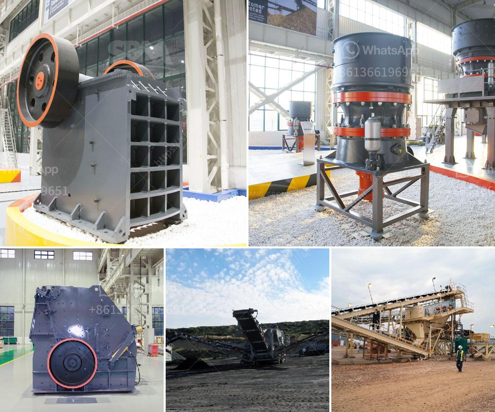

<h3>grinding mills in china</h3>
The demand for grinding mills in China continues to grow, driven by the country's rapid economic development and industrialization. Grinding mills are key equipment in various industries such as mining, cement, and construction, providing necessary pulverization and grinding solutions for materials. This article will provide an overview of grinding mills in China, discussing their importance, types, and major manufacturers.

Grinding mills play a vital role in various industrial processes, facilitating the creation of powdered materials. These mills use mechanical force to break down large solid materials into smaller particles, enhancing their surface area, and enabling efficient chemical reactions, reduction in particle size, and separation of valuable components. In China, the grinding mill industry has witnessed significant growth in recent years, catering to various sectors like manufacturing, construction, and mining.

There are several types of grinding mills available in China, designed to cater to different needs and applications. Ball mills, for instance, are widely used for fine grinding, mixing, and blending solid materials in ceramic, pharmaceutical, chemical, and food industries. Meanwhile, rod mills are commonly utilized in mining operations for grinding ores. Additionally, there are also vertical mills, including roller mills, that offer energy-efficient solutions for grinding raw materials in the cement and power generation industries.

China boasts a large number of grinding mill manufacturers who manufacture and supply various types of mills to domestic and international markets. From well-established companies like CITIC Heavy Industries and China National Heavy Machinery Corporation to emerging players like Shanghai Clirik Machinery Co., Ltd. and Guilin Hongcheng Mining Equipment Manufacture Co., Ltd., China's grinding mill industry offers a wide range of choices for customers.

CITIC Heavy Industries, one of the leading grinding mill manufacturers in China, has a diverse product portfolio with cutting-edge technologies. Its mills are widely used in the mining industry for ore grinding, as well as in the cement and power sectors. The company focuses on technological innovation and has a strong research and development team to ensure its products meet market demands.

Another prominent player in China's grinding mill industry is Shanghai Clirik Machinery Co., Ltd. The company specializes in manufacturing high-quality grinding mills, which are widely used in areas such as limestone grinding, bentonite grinding, gypsum grinding, and coal grinding. Clirik's mills are known for their performance, durability, and reliability.

Guilin Hongcheng Mining Equipment Manufacture Co., Ltd. is also a major player in China's grinding mill market. The company offers a wide range of grinding mills, including Raymond mills, ultra-fine mills, vertical mills, and ultra-fine vertical mills. Hongcheng's mills are recognized for their advanced technology, high efficiency, and environmental friendliness.

In conclusion, grinding mills are essential equipment in China's industrial development, providing efficient pulversization and grinding solutions for various sectors. As the demand continues to grow, the country's grinding mill industry offers a diverse range of mills to cater to specific customer needs. With companies like CITIC Heavy Industries, Shanghai Clirik Machinery Co., Ltd., and Guilin Hongcheng Mining Equipment Manufacture Co., Ltd. leading the way, China's grinding mill manufacturers are meeting the challenges of a rapidly changing market and contributing to the country's economic growth.
<h3>Contact us</h3><ul><li><strong>Whatsapp:&nbsp;<a href="https://wa.me/8613661969651">+8613661969651</a></strong></li><li><a href="https://swt.shibang-china.com/?git&amp;zhl&amp;grinding mills in china"><strong>Online Service(chat now)</strong></a></li></ul><h3>Related</h3><ul><li><a href='compact vibrating ball mill manufactures.md'>compact vibrating ball mill manufactures</a></li><li><a href='sand mining for construction in equatorial guinea.md'>sand mining for construction in equatorial guinea</a></li><li><a href='vibrating screen in egypt.md'>vibrating screen in egypt</a></li><li><a href='stone grinder machine for marble.md'>stone grinder machine for marble</a></li><li><a href='300 tph jaw crusher.md'>300 tph jaw crusher</a></li></ul>