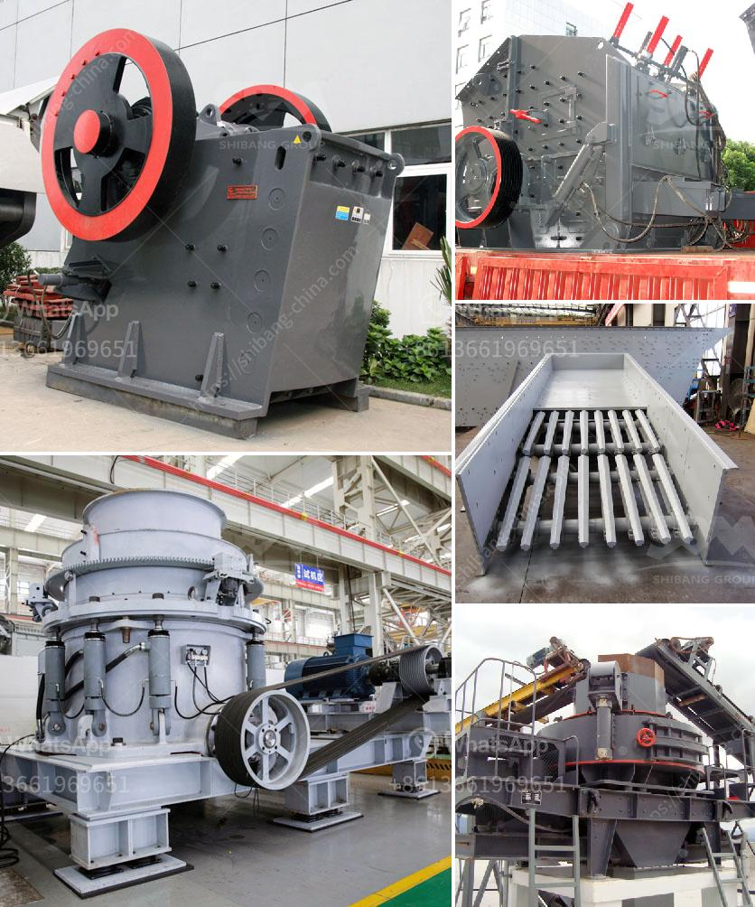

<h3>grinding mills supplier in gujranwala pakistan</h3>
Grinding mills are used for grinding raw materials or industrial materials into fine powder. The demand for these grinding mills has been increasing rapidly as they are essential pieces of machinery for various industries. To meet these demands, numerous grinding mills suppliers have emerged in the market. One such supplier in Gujranwala, Pakistan, has been gaining popularity due to its commitment to high-quality products and exceptional customer service.

Gujranwala is a thriving industrial city located in the province of Punjab, Pakistan. Renowned for its industrial sector, Gujranwala is home to various industries, including textiles, ceramics, food processing, and more. With the growth of these industries, the demand for grinding mills has surged significantly. Recognizing this market opportunity, grinding mills suppliers in Gujranwala have been striving to meet the requirements of the industrial sector.

One prominent grinding mills supplier in Gujranwala is known for its dedication to delivering top-notch products. They offer a wide range of grinding mills that cater to the diverse needs of different industries. From ball mills to hammer mills, this supplier has a comprehensive collection of grinding mills suitable for various applications. They ensure that each mill is manufactured using high-quality, durable materials to guarantee longevity and efficiency.

The supplier's commitment to quality is also reflected in their adherence to international standards. Each grinding mill undergoes rigorous testing procedures to ensure it meets all safety and quality regulations. By adhering to these standards, this supplier aims to build trust and credibility among its customers, both locally and internationally.

In addition to providing excellent products, this grinding mills supplier in Gujranwala prioritizes customer satisfaction. They believe in building long-term relationships with their clients by providing exceptional after-sales services. They have a proficient technical support team that is readily available to assist customers with any queries or concerns. Whether it is installation guidance or troubleshooting assistance, this supplier goes the extra mile to ensure that their customers' needs are met.

Furthermore, this supplier understands the importance of timely delivery. They have a robust logistics system in place to ensure that grinding mills are delivered to customers promptly and efficiently. By maintaining a reliable supply chain, they aim to minimize downtime for their clients and keep their operations running smoothly.

It is worth mentioning that this grinding mills supplier in Gujranwala also offers customization options. They understand that different industries have unique requirements, and therefore, they provide tailored solutions to meet these specific needs. This flexibility sets them apart from their competitors and enables them to cater to a wide range of industrial sectors effectively.

In conclusion, the grinding mills supplier in Gujranwala, Pakistan, has become a trusted name in the industry. With their commitment to delivering high-quality products, exceptional customer service, and customization options, they have been successful in fulfilling the demands of the industrial sector. As Gujranwala's industrial sector continues to grow, the need for reliable grinding mills suppliers becomes increasingly important, and this supplier is perfectly positioned to meet these evolving demands.
<h3>Contact us</h3><ul><li><strong>Whatsapp:&nbsp;<a href="https://wa.me/8613661969651">+8613661969651</a></strong></li><li><a href="https://swt.shibang-china.com/?git&amp;zhl&amp;grinding mills supplier in gujranwala pakistan"><strong>Online Service(chat now)</strong></a></li></ul><h3>Related</h3><ul><li><a href='concrete crusher in georgia.md'>concrete crusher in georgia</a></li><li><a href='river stone crusher plant for sale in india.md'>river stone crusher plant for sale in india</a></li><li><a href='silica sand manufacturing process.md'>silica sand manufacturing process</a></li><li><a href='diesel compressors for sale in south africa.md'>diesel compressors for sale in south africa</a></li><li><a href='crusher machine for sale tanzania.md'>crusher machine for sale tanzania</a></li></ul>