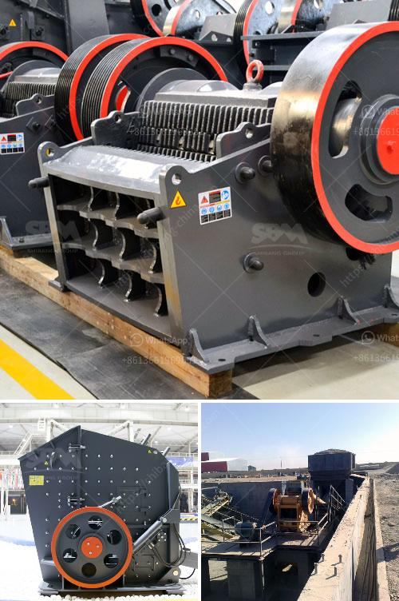

<h3>grinding of calcined gypsum</h3>
Calcined gypsum, commonly known as plaster of Paris, is a versatile material used in various industries, including construction, arts, and medicine. Its high calcium sulfate concentration and ability to be easily molded and hardened make it an excellent choice for a range of applications. However, to maximize its potential, the calcined gypsum often needs to undergo grinding, a process that enhances its performance and improves its handling characteristics.

The grinding of calcined gypsum serves multiple purposes. Firstly, it reduces the particle size of the material, resulting in a finer powder. This finer powder can be easily mixed with other materials, such as sand and water, to create gypsum boards, plasters, or other products. The reduced particle size also enhances the spreadability and workability of the material, making it easier to achieve a smooth and uniform finish during application.

Secondly, grinding calcined gypsum helps activate the material's binding properties, improving its strength and durability. When calcined gypsum is ground, the increased surface area allows for better hydration and reaction with the mixing water, leading to enhanced cohesion and hardness. This means that gypsum-based products, such as plasters or joint compounds, can better withstand the rigors of everyday use, reducing the need for repairs or replacements.

Moreover, grinding of calcined gypsum offers additional advantages. It can help remove impurities or lumps that might be present in the material, ensuring a consistent quality throughout the production process. Grinding can also modify the setting time of the gypsum, allowing manufacturers to tailor the material's performance according to specific application requirements.

In conclusion, grinding of calcined gypsum is a crucial step in maximizing its potential as a building material. By reducing particle size, activating binding properties, and enhancing overall performance, the ground gypsum can deliver superior results in various construction projects. Whether it is in creating durable plaster finishes or manufacturing high-quality gypsum boards, the grinding process plays a vital role in enhancing the performance and versatility of calcined gypsum.
<h3>Contact us</h3><ul><li><strong>Whatsapp:&nbsp;<a href="https://wa.me/8613661969651">+8613661969651</a></strong></li><li><a href="https://swt.shibang-china.com/?git&amp;zhl&amp;grinding of calcined gypsum"><strong>Online Service(chat now)</strong></a></li></ul><h3>Related</h3><ul><li><a href='gravel and sand mining equipment.md'>gravel and sand mining equipment</a></li><li><a href='harga powerful crusher machine.md'>harga powerful crusher machine</a></li><li><a href='california rock crusher machine.md'>california rock crusher machine</a></li><li><a href='pulverizer coal with gasifier.md'>pulverizer coal with gasifier</a></li><li><a href='chrome crusher philippines.md'>chrome crusher philippines</a></li></ul>