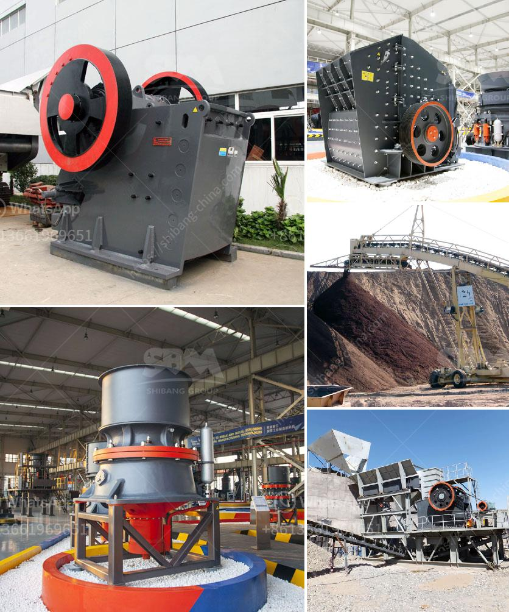

<h3>grinding size of limestone</h3>
The grinding size of limestone plays a crucial role in the final quality of the end product. As more industries are discovering the numerous uses of limestone, demanding higher quantities and better qualities of this material, it has become essential to optimize the grinding process and determine the ideal grinding size.

Limestone is a versatile mineral known for its uses in construction, agriculture, and even in pharmaceutical and cosmetic products. To harness the full potential of limestone, it needs to be finely ground to achieve the desired physical and chemical properties.

Grinding size refers to the particle size distribution achieved during the grinding process. It is usually measured by the specific surface area (SSA), which represents the total surface area of particles in a given volume of material. The SSA is inversely related to the grinding size – finer particles have a larger SSA.

The choice of grinding size for limestone depends on several factors, including the intended application and end use of the product. In agriculture, for example, finely ground limestone is used as a soil amendment to neutralize acidic soils and improve nutrient availability. In this case, a grinding size of 100-300 mesh is typically recommended to achieve better soil conditions and plant growth.

In the construction industry, limestone is commonly used as an aggregate in concrete and as a filler in asphalt. For these applications, a coarser grinding size, such as 16-30 mesh, is often preferred to ensure good workability and proper bonding with other materials.

Meanwhile, in industries like pharmaceuticals and cosmetics, limestone is required in ultra-fine powder form for its functional and aesthetic properties. Achieving a grinding size of less than 100 mesh is vital to guarantee the desired texture, color, and consistency of the final product.

To achieve the desired grinding size of limestone, various grinding techniques and equipment are utilized, including ball mills, impact mills, and vertical roller mills. The choice of equipment depends on factors such as the desired particle size distribution and the specific energy consumption required for grinding.

In conclusion, the grinding size of limestone is a critical factor that directly impacts the quality and suitability of its end products. It determines the functional and aesthetic properties of various industries, from construction to agriculture, pharmaceuticals, and cosmetics. Precise control over grinding size allows us to fully harness the potential of limestone and optimize its numerous applications in modern society.
<h3>Contact us</h3><ul><li><strong>Whatsapp:&nbsp;<a href="https://wa.me/8613661969651">+8613661969651</a></strong></li><li><a href="https://swt.shibang-china.com/?git&amp;zhl&amp;grinding size of limestone"><strong>Online Service(chat now)</strong></a></li></ul><h3>Related</h3><ul><li><a href='stone crusher manufacturers in ludhiana.md'>stone crusher manufacturers in ludhiana</a></li><li><a href='stone crusher sale in peru.md'>stone crusher sale in peru</a></li><li><a href='coal crusher capacity price.md'>coal crusher capacity price</a></li><li><a href='100 per ton coal crush and screen plant.md'>100 per ton coal crush and screen plant</a></li><li><a href='quarry equipment china.md'>quarry equipment china</a></li></ul>