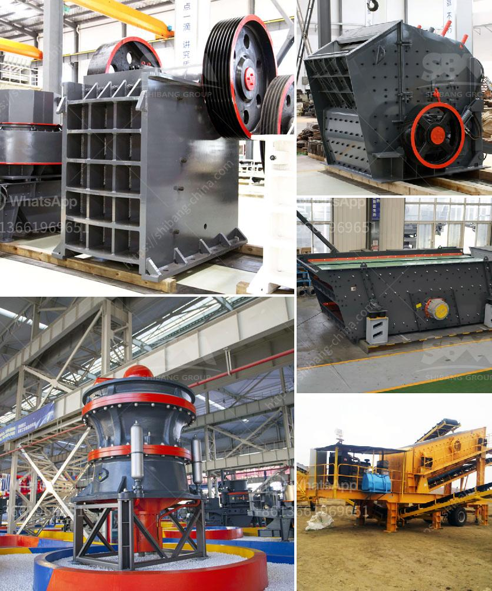

<h3>grinding unit and plant in india</h3>
India is the second-largest cement producer in the world, with a production capacity of over 500 million tonnes per annum. The cement industry in India is vibrant and highly competitive, with several players vying to capture a significant market share. The establishment of grinding units and plants across the country has been a crucial factor in sustaining this growth and supporting infrastructure development.

Grinding units are standalone cement production units, typically used for grinding clinker into cement. They are usually located closer to consumption centers, which helps in reducing transportation costs and ensuring timely supply to customers. These units play a pivotal role in meeting the increasing demands of cement in various regions by catering to specific geographies.

One prominent player in the grinding unit and plant segment in India is UltraTech Cement, part of the Aditya Birla Group. UltraTech has a presence in various states across India, with multiple grinding units strategically located near major cities. UltraTech's grinding units employ the latest technology to produce high-quality cement, meeting the stringent requirements of the construction industry.

The grinding units in India are designed to produce different types of cement, including Ordinary Portland Cement (OPC), Portland Pozzolana Cement (PPC), and Portland Slag Cement (PSC). These different types of cement cater to various applications and construction requirements. OPC is commonly used for general construction, while PPC offers enhanced durability and resistance to adverse conditions. PSC, on the other hand, is known for its high strength and durability, making it ideal for infrastructure projects.

The plants and grinding units in India are equipped with modern machinery and equipment, ensuring efficient and sustainable cement production. These units adopt environmentally friendly practices such as waste heat recovery systems, which help reduce energy consumption and carbon emissions. In addition, the usage of alternative fuels and raw materials further contributes to the sustainability of cement production.

The establishment of grinding units and plants in India has positively impacted the growth of the cement industry. The presence of these units near consumption centers ensures a steady supply of cement, which is crucial for infrastructure development. Moreover, these units also generate employment opportunities and contribute to the economic growth of the regions they are located in.

With the government emphasizing infrastructure development, the demand for cement in India is expected to witness significant growth in the coming years. To meet this burgeoning demand, cement manufacturers are continuously expanding their grinding unit and plant capacities. The expansion of these units not only ensures a consistent supply of cement but also aids in regional economic development.

In conclusion, grinding units and plants in India play a vital role in meeting the escalating demands of the cement industry. These units are strategically located near consumption centers, producing high-quality cement using modern technology. The expansion of these units is instrumental in supporting infrastructure development and bolstering the economy. With the growing focus on sustainable practices, the cement industry in India is poised for further growth and contributes to the nation's progress.
<h3>Contact us</h3><ul><li><strong>Whatsapp:&nbsp;<a href="https://wa.me/8613661969651">+8613661969651</a></strong></li><li><a href="https://swt.shibang-china.com/?git&amp;zhl&amp;grinding unit and plant in india"><strong>Online Service(chat now)</strong></a></li></ul><h3>Related</h3><ul><li><a href='double toggle jaw crushers.md'>double toggle jaw crushers</a></li><li><a href='europe crusher producers.md'>europe crusher producers</a></li><li><a href='complete rock crusher machine prices in pakistan.md'>complete rock crusher machine prices in pakistan</a></li><li><a href='aggregate production equipment.md'>aggregate production equipment</a></li><li><a href='complete scm stone crushing plant 4tph.md'>complete scm stone crushing plant 4tph</a></li></ul>