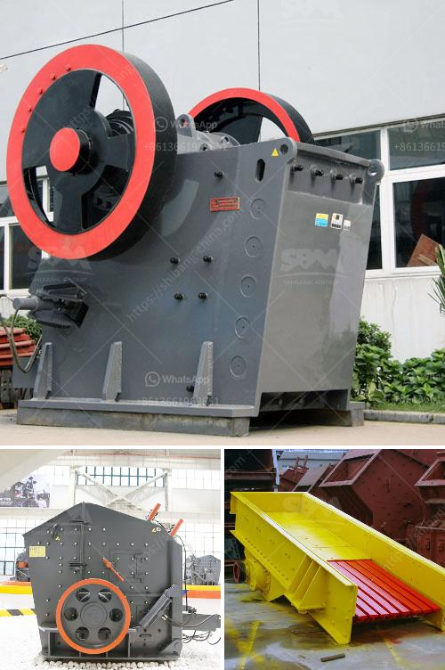

<h3>grizzly screen for sale nz</h3>
If you are in the construction or mining industry in New Zealand, chances are you have heard of or even used a grizzly screen. These screens are an essential piece of equipment that helps in separating and sorting materials efficiently. Whether you are looking to buy a grizzly screen for the first time or upgrade your existing one, finding a reliable seller for a grizzly screen for sale in NZ is crucial.

A grizzly screen, also known as a grizzly scalper or simply a grizzly, is a heavy-duty screening machine that is commonly used in the preliminary stages of material processing. Its primary function is to remove large rocks and other debris before the material enters a crusher or processing plant. This helps prevent damage to the equipment and enhances the overall efficiency of the operation.

There are several factors to consider when looking for a grizzly screen for sale in NZ. Firstly, you need to determine the capacity and size requirements of your operation. Grizzly screens come in various sizes, and choosing the right one will depend on the type of material you are working with and the production rates you expect to achieve. Additionally, consider the available space at your site and any portability requirements.

Another important factor to consider is the construction materials and design of the grizzly screen. Look for a screen that is made of durable materials such as high-quality steel, as it will need to withstand heavy loads and harsh working conditions. The design should also be optimized for efficient screening, with properly sized openings and the ability to easily adjust the screening angle.

When searching for a grizzly screen for sale in NZ, it is crucial to choose a reputable seller or manufacturer. Look for a company that specializes in screening equipment and has a proven track record in providing reliable and high-quality products. Check customer reviews and testimonials to get a better idea of their reputation and the level of customer satisfaction.

Consider the after-sales support and warranty provided by the seller. A reputable company will offer comprehensive support, including installation assistance, maintenance guidance, and readily available spare parts. This is crucial for the smooth operation and longevity of your grizzly screen.

In conclusion, finding a reliable seller for a grizzly screen for sale in NZ is essential for construction and mining companies. Grizzly screens play a crucial role in the material sorting process, preventing damage to equipment and improving overall efficiency. When searching for a grizzly screen, consider factors such as capacity requirements, construction materials, design, and the reputation of the seller. By investing in a high-quality grizzly screen and choosing a reputable seller, you can enhance the productivity and success of your operation.
<h3>Contact us</h3><ul><li><strong>Whatsapp:&nbsp;<a href="https://wa.me/8613661969651">+8613661969651</a></strong></li><li><a href="https://swt.shibang-china.com/?git&amp;zhl&amp;grizzly screen for sale nz"><strong>Online Service(chat now)</strong></a></li></ul><h3>Related</h3><ul><li><a href='technical features of stone crusher.md'>technical features of stone crusher</a></li><li><a href='output size for a jaw crusher.md'>output size for a jaw crusher</a></li><li><a href='grinding mill machine cost price south africa.md'>grinding mill machine cost price south africa</a></li><li><a href='iron ore pelletisation plant china.md'>iron ore pelletisation plant china</a></li><li><a href='price of crusher.md'>price of crusher</a></li></ul>