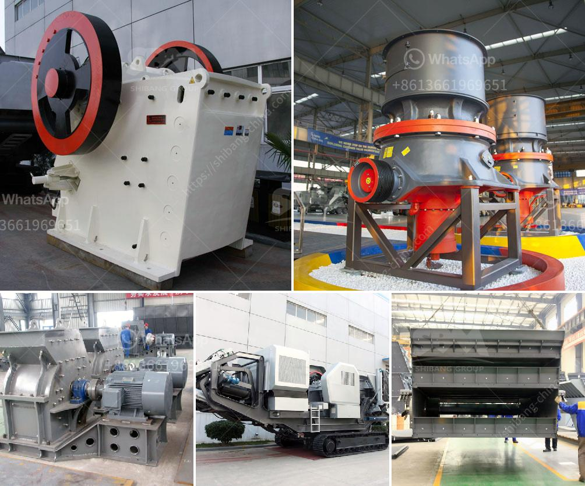

<h3>gypsum board making machine supplier</h3>
Are you in the construction business and looking for a reliable gypsum board making machine supplier? Look no further! In this article, we will explore the importance of having a trustworthy supplier and introduce you to one of the leading gypsum board making machine suppliers in the market.

Investing in high-quality machinery is crucial for any construction project to ensure durable and cost-effective results. Gypsum board, also known as drywall or plasterboard, is a widely used material in the construction industry. It is known for its fire-resistant, soundproof, and mold-resistant properties, making it a preferred choice for building walls and ceilings.

When it comes to choosing a supplier for your gypsum board making machine, there are several factors to consider. First and foremost, reliability and reputation should be your top priorities. A reliable supplier ensures that you receive the machinery on time and in good condition, minimizing any delays in your construction projects.

In addition, it is essential to choose a supplier that offers a wide range of gypsum board making machines to cater to your specific needs. Whether you require a small-scale machine for a small construction project or a large-scale machine for mass production, having options is always beneficial.

Furthermore, a supplier with expertise in the field will be able to guide you through the selection process and provide valuable advice regarding technical specifications and features of the machines. Their knowledge and experience can help you make an informed decision and avoid any costly mistakes.

One of the leading gypsum board making machine suppliers in the market is ABC Company. With years of experience in the industry, ABC Company has established an excellent reputation for delivering top-quality machinery and excellent customer service.

ABC Company offers a wide range of gypsum board making machines, including automatic, semi-automatic, and manual models. Their machines are manufactured using the latest technology and feature robust construction to guarantee durability and efficiency.

In addition to high-quality machinery, ABC Company also provides comprehensive after-sales support. This includes installation, training, and maintenance services to ensure that your machine operates smoothly and efficiently throughout its lifespan. Their team of experts is always available to assist you with any queries or concerns you may have.

Choosing ABC Company as your gypsum board making machine supplier not only ensures reliable machinery but also peace of mind. Their commitment to customer satisfaction and product quality makes them the ideal partner for your construction business.

To sum up, finding a reliable and trustworthy gypsum board making machine supplier is crucial for the success of your construction projects. With the expertise and product range offered by ABC Company, you can rest assured that you are investing in a high-quality machine that will meet your specific requirements. Consider ABC Company as your supplier, and you can focus on achieving your construction goals with confidence.
<h3>Contact us</h3><ul><li><strong>Whatsapp:&nbsp;<a href="https://wa.me/8613661969651">+8613661969651</a></strong></li><li><a href="https://swt.shibang-china.com/?git&amp;zhl&amp;gypsum board making machine supplier"><strong>Online Service(chat now)</strong></a></li></ul><h3>Related</h3><ul><li><a href='limestone processing plant philippines.md'>limestone processing plant philippines</a></li><li><a href='gravel making machine.md'>gravel making machine</a></li><li><a href='stone dust processing machine.md'>stone dust processing machine</a></li><li><a href='hammer mill 200 mesh.md'>hammer mill 200 mesh</a></li><li><a href='lime morter grinding machine price list.md'>lime morter grinding machine price list</a></li></ul>