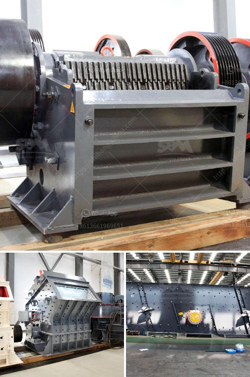

<h3>gypsum board making machine</h3>
The construction industry has evolved significantly over the years, with the introduction of advanced technologies and machinery. Among these innovations, the gypsum board making machine has emerged as a game-changer, revolutionizing the way gypsum boards are manufactured. This machine has not only streamlined the production process but has also improved the quality and durability of gypsum boards used in construction.

Gypsum, a mineral widely found in nature, is commonly used in the construction industry due to its fire-resistant and soundproofing properties. Gypsum boards, also known as drywall or plasterboard, have become an integral part of modern building construction. They provide a smooth and uniform surface, making them ideal for walls and ceilings.

The gypsum board making machine automates the production process, eliminating manual labor and speeding up the manufacturing process. It consists of various components, including a gypsum mixer, forming machine, drying oven, and cutting machine. The machine takes raw gypsum powder, water, and other additives and mixes them thoroughly to form a pulp-like mixture. This mixture is then poured onto a moving belt, where it is evenly spread and compressed. The continuous moving belt ensures a smooth and even board formation. The boards are then sent to a drying oven, where excess moisture is removed, ensuring optimal strength and durability.

The gypsum board making machine offers several advantages over traditional manufacturing methods. Firstly, it significantly reduces labor costs and human errors, resulting in efficient and consistent production. Secondly, it ensures precise and accurate board dimensions, leading to uniformity and easy installation. Additionally, the drying process in the machine eliminates the risk of deformities or cracks, resulting in high-quality boards that are less prone to damage. Lastly, the machine allows for customization, enabling manufacturers to produce boards of various sizes, thicknesses, and surface textures as per customer requirements.

In conclusion, the gypsum board making machine has transformed the construction industry by simplifying and enhancing the production of gypsum boards. Its ability to automate the manufacturing process, improve product quality, and offer customization options has made it an indispensable tool for gypsum board manufacturers. As the demand for gypsum boards continues to rise, this machine is expected to play a pivotal role in ensuring efficient and sustainable construction practices in the future.
<h3>Contact us</h3><ul><li><strong>Whatsapp:&nbsp;<a href="https://wa.me/8613661969651">+8613661969651</a></strong></li><li><a href="https://swt.shibang-china.com/?git&amp;zhl&amp;gypsum board making machine"><strong>Online Service(chat now)</strong></a></li></ul><h3>Related</h3><ul><li><a href='cost of mining process of calcium carbonate.md'>cost of mining process of calcium carbonate</a></li><li><a href='m sand project cost details.md'>m sand project cost details</a></li><li><a href='quartz bulk supplier sri lanka.md'>quartz bulk supplier sri lanka</a></li><li><a href='impact crusher saudi arabia.md'>impact crusher saudi arabia</a></li><li><a href='bentonite mill project report.md'>bentonite mill project report</a></li></ul>