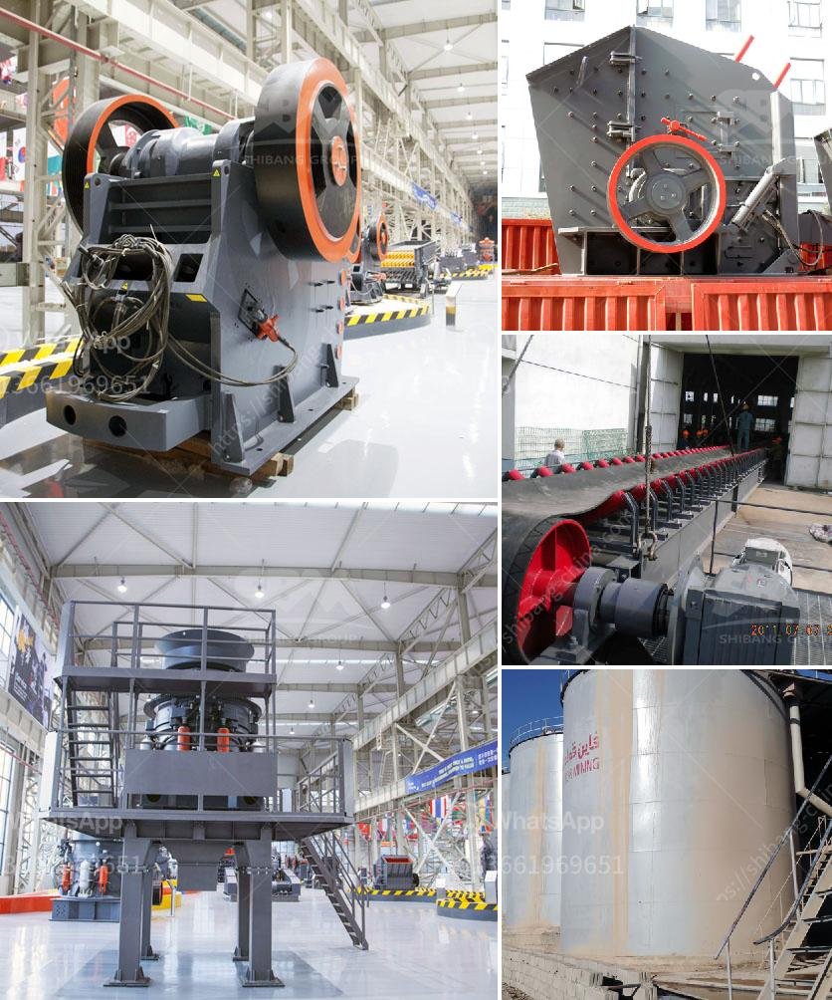

<h3>gypsum board manufacturing plant cost india</h3>
Gypsum board, also known as drywall or plasterboard, is a common building material used worldwide. It is primarily used for walls and ceilings, and offers several advantages such as sound insulation, fire resistance, and durability. As a result, the demand for gypsum board in India is steadily increasing.

Setting up a gypsum board manufacturing plant can be a complex process, requiring significant investment. But with careful planning and execution, it can prove to be a profitable venture. Let's take a closer look at the costs involved in establishing a gypsum board manufacturing plant in India.

One of the most important aspects of starting a gypsum board plant is the location. Factors such as proximity to raw material sources, availability of skilled labor, and access to transportation facilities play a crucial role. The cost of land varies significantly depending on the location, but it is advisable to choose an area closer to gypsum mines to reduce transportation costs.

The next major expense is machinery and equipment. The manufacturing process of gypsum board involves several stages, including gypsum mining, calcination, grinding, mixing, forming, drying, and packaging. Each step requires specific machinery, such as crushers, shredders, gypsum mills, vibrating screens, and conveyor belts. The cost of these machines can vary depending on their size, capacity, and quality, but it is essential to invest in reliable and efficient equipment to ensure the smooth operation of the plant.

Another significant cost in setting up a gypsum board manufacturing plant is the raw material. Gypsum, the primary ingredient in gypsum board, is abundantly available in India. However, its cost can fluctuate due to factors such as seasonality, transportation, and demand-supply dynamics. Therefore, it is crucial to establish long-term contracts with gypsum suppliers to secure a stable and affordable supply.

Labor costs also need to be considered when estimating the overall cost of the plant. Skilled and semi-skilled workers are required for various tasks, such as manufacturing, maintenance, and quality control. The number of employees needed depends on the scale of the project, but it is advisable to hire experienced professionals who are familiar with the gypsum board manufacturing process.

In addition to the initial investment, ongoing expenses such as utility bills, maintenance, and transportation costs should be incorporated into the budget. These costs can vary significantly depending on the plant's size, location, and production capacity.

To navigate through the process of establishing a gypsum board manufacturing plant in India, it is advisable to seek guidance from industry experts and consult regulatory authorities. They can provide valuable insights regarding licensing and permits, environmental regulations, safety standards, and market dynamics.

In conclusion, while setting up a gypsum board manufacturing plant in India can be a substantial investment, it also offers an opportunity for lucrative returns. By carefully considering the various costs involved and creating a robust business plan, entrepreneurs can capitalize on the growing demand for gypsum board in the construction industry.
<h3>Contact us</h3><ul><li><strong>Whatsapp:&nbsp;<a href="https://wa.me/8613661969651">+8613661969651</a></strong></li><li><a href="https://swt.shibang-china.com/?git&amp;zhl&amp;gypsum board manufacturing plant cost india"><strong>Online Service(chat now)</strong></a></li></ul><h3>Related</h3><ul><li><a href='limestone mobile crushing plant.md'>limestone mobile crushing plant</a></li><li><a href='the company mines limestone in ethiopia.md'>the company mines limestone in ethiopia</a></li><li><a href='roller screen for coal.md'>roller screen for coal</a></li><li><a href='cost 100tpd cement plant india.md'>cost 100tpd cement plant india</a></li><li><a href='portable rock crusher rental.md'>portable rock crusher rental</a></li></ul>