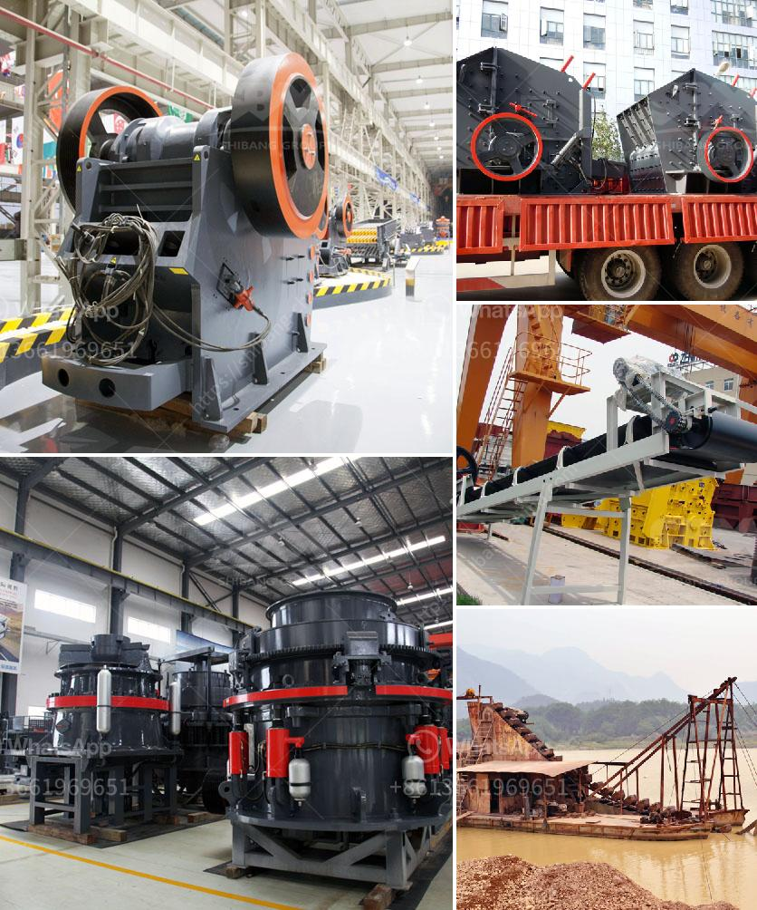

<h3>gypsum board production line for sale</h3>
Gypsum board, also known as drywall or plasterboard, is a key building material used in the construction industry for creating walls and ceilings. It offers various advantages such as fire resistance, sound isolation, and ease of installation. As the demand for gypsum board continues to rise, the need for efficient and reliable production lines becomes crucial.

A gypsum board production line is a specialized piece of machinery designed to precisely mix, shape, and cut gypsum boards to desired specifications. These production lines are capable of producing high-quality boards in a continuous manner, leading to increased productivity and cost-efficiency.

For those in the market for a gypsum board production line, there are various options available for sale. When considering a purchase, it is essential to choose a production line that meets your specific requirements. Factors to consider include production capacity, level of automation, and the size of the boards to be manufactured.

A typical gypsum board production line consists of several key components, such as a gypsum mixer, conveyor belts, forming tables, and cutting machines. The mixer is responsible for accurately mixing the gypsum powder with water and other additives to form a homogeneous mixture. The conveyor belts transport the mixture to the forming tables, where it is shaped and flattened into boards of precise dimensions. Finally, cutting machines help cut the boards to the desired length.

Investing in a gypsum board production line can bring numerous benefits for construction companies and contractors. By having their own production line, they can have better control over the quality of the boards, ensure timely delivery, and reduce costs associated with outsourcing. Additionally, the ability to customize the boards to meet specific project requirements can give companies a competitive edge in the market.

In conclusion, a gypsum board production line for sale can be an excellent investment for construction companies looking to streamline their operations and enhance their competitiveness. With a variety of options available, it is essential to carefully assess your requirements and choose a production line that aligns with your goals. Investing in a high-quality production line will not only result in superior gypsum boards but will also lead to increased profits and customer satisfaction.
<h3>Contact us</h3><ul><li><strong>Whatsapp:&nbsp;<a href="https://wa.me/8613661969651">+8613661969651</a></strong></li><li><a href="https://swt.shibang-china.com/?git&amp;zhl&amp;gypsum board production line for sale"><strong>Online Service(chat now)</strong></a></li></ul><h3>Related</h3><ul><li><a href='stone hammer mills in china.md'>stone hammer mills in china</a></li><li><a href='stone crusher in himachal pradesh.md'>stone crusher in himachal pradesh</a></li><li><a href='compact vibrating ball mill manufactures.md'>compact vibrating ball mill manufactures</a></li><li><a href='roller mill suppliers in mexico.md'>roller mill suppliers in mexico</a></li><li><a href='bentonite production process.md'>bentonite production process</a></li></ul>